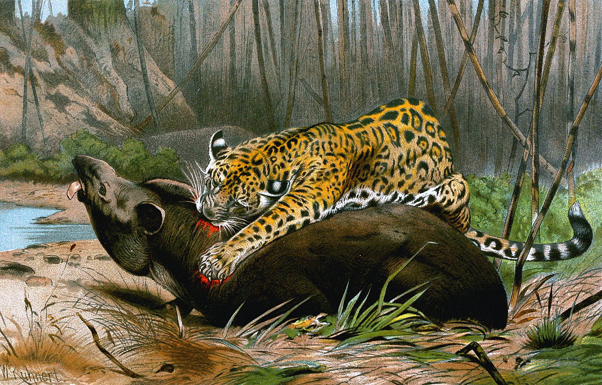
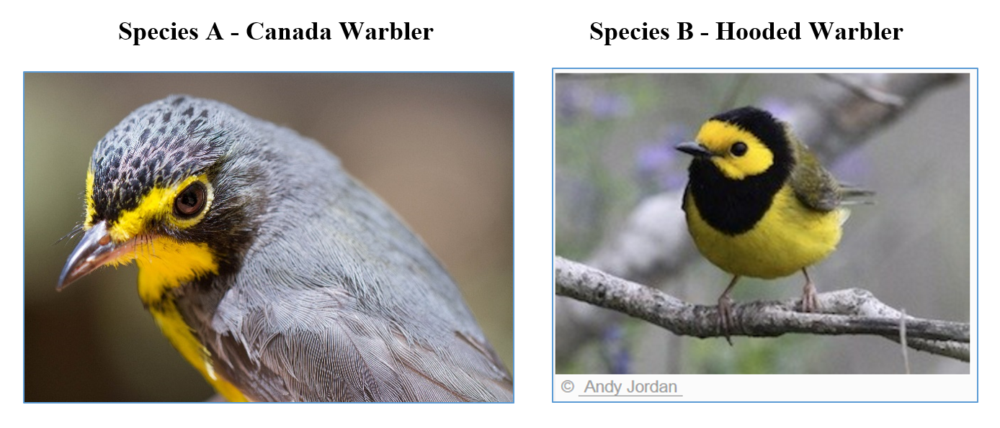

## Lab 6 Assignment --- Models of Interspecific Interactions <br> Due by 5:00pm on Friday


Answer each of the following questions and upload your Excel file and
R script to ELC. Be sure to show your calculations. Undergraduates
only have to do Exercise I in R.


### Exercise I 

You are studying the dynamics of jaguar (*Panthera onca*) and Baird's
tapir (*Tapirus bairdii*) in Costa Rica's Corcavodo National Park. After
years of research, you obtain the following parameter estimates, which
you would like to use in a Lotka-Volterra model: $r^{prey}=0.05$,
$k^{pred}=0.0005$, $b^{pred}=0.001$, and $d^{pred}=0.45$.  

(A)  What predator population size corresponds to prey equilibrium? What prey population size corresponds to predator equilibrium?
(B)  Project the populations 100 years following an initial prey population size of $N_0^{prey}=500$ and an initial predator population size of $N_0^{pred}=100$. Plot the projections.
(C)  Clearly, these populations have not reached a stable equilibrium, so what is the interpretation of the equilibrium values from part (a)? What happens if you set the initial population sizes to the equilibrium values?


{width="85%"}

<br>

### Exercise II

The Canada warbler (*Cardellina canadensis*) and the hooded
warbler (*Stetophaga citrina*) are two species of
Neotropical-Nearctic migratory birds that appear to compete for the
same resources where their ranges meet in the southern Appalachian
Mountains. Assume their dynamics follow the Lotka-Volterra competition
model with parameters $r^{A}=0.2$, $r^{B}=0.3$,
$K^{A}=250$, $K^{B}=200$, $\alpha^{A}=0.1$, and 
$\alpha^{B}=0.1$.

(A)  Plot 25 years of dynamics following initial conditions of  $N_0^A = 200$ and $N_0^B=50$.
(B)  What are the 2 equilibrium values for these species?
(C)  Do these conditions describe stable coexistence, competitive exclusion, or unstable equilibrium?
(D)  What is the minimum value of $\alpha^B$ that would result in competitive exclusion of species A? (Hint: Use the equilibrium equations to solve for $\alpha^B$). Plot 25 years of dynamics under this scenario. Use the same initial abundance values as before. 




<br>

### R example


```{r}
#| label: pred-prey
#| out-width: "75%"
#| fig-align: center
nYears <- 5000
r.prey <- 0.01
k.pred <- 0.00001
b.pred <- 0.00001
d.pred <- 0.01
N.prey <- rep(NA, nYears)
N.pred <- rep(NA, nYears)
N.prey[1] <- 1000
N.pred[1] <- 300
for(t in 2:nYears) {
    N.prey[t] <- N.prey[t-1] + N.prey[t-1]*(r.prey-k.pred*N.pred[t-1])
    N.pred[t] <- N.pred[t-1] + N.pred[t-1]*(b.pred*N.prey[t-1] - d.pred)
}
plot(1:nYears, N.prey, type="l", col="black", ylim=c(0, 3500),
     xlab="Year", ylab="Abundance")
lines(1:nYears, N.pred, type="l", col="blue")
legend(1, 3500, c("Prey", "Predator"), lty=1, col=c("black", "blue"))
```
