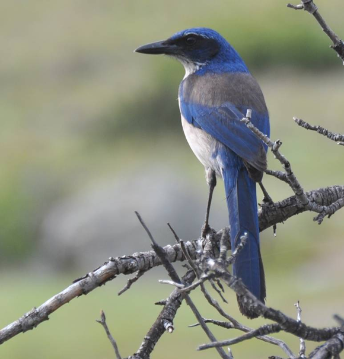
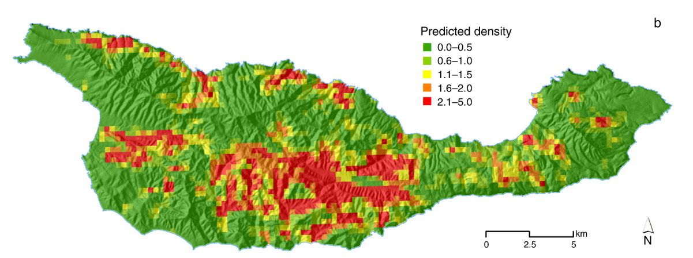
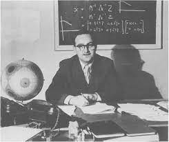
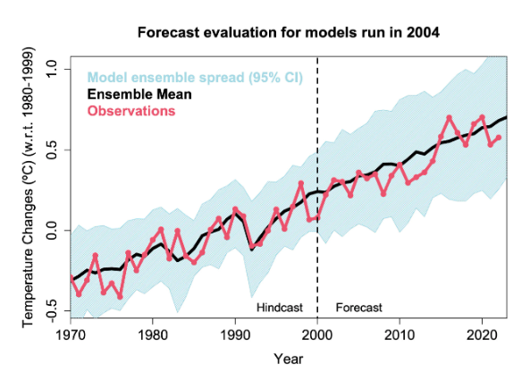
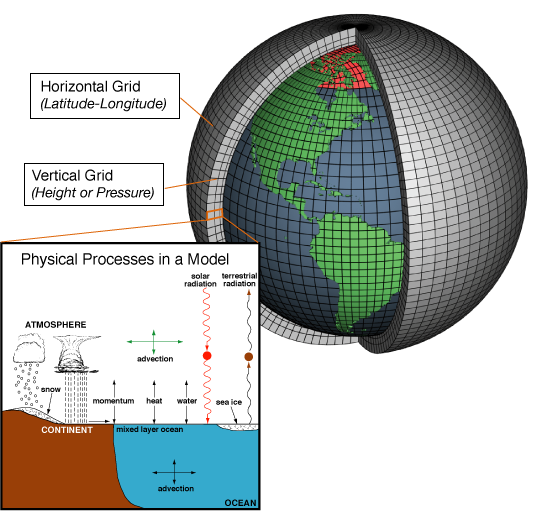
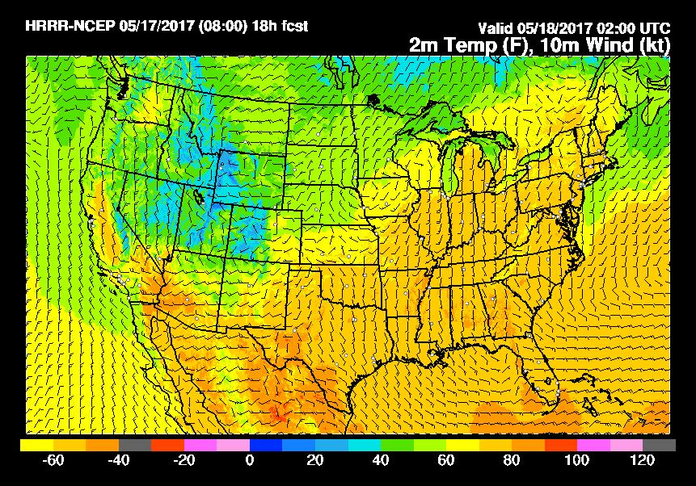

# Definitions {visibility="hidden"}


## BIDE fig to be hidden {visibility="hidden"}
```{r}
#| label: bide0
#| echo: false
#| include: false
#| fig.width: 8
#| fig.height: 6
#| fig-cap: "BIDE model"
#| fig-alt: "BIDE model example"
T <- 20
N <- integer(T)
B <- D <- I <- E <- integer(T-1)
N[1] <- 100
set.seed(340)
for(t in 1:(T-1)) {
  B[t] <- rpois(1, N[t]*0.2)
  D[t] <- rbinom(1, N[t], 0.1)
  I[t] <- rpois(1, 0.2)
  E[t] <- rpois(1, N[t]*0.05)
  N[t+1] <- N[t] + B[t] + I[t] - D[t] - E[t]
}
par(mai=c(0.9, 0.5, 0.2, 0.2))
plot(1:T, N, ylim=c(0, max(N)), type="o", xlab="Year",
     ylab="", pch=16, cex.lab=1.7)
lines(1:(T-1), B, col="blue", pch=17, type="o")
lines(1:(T-1), I, col="green", pch=18, type="o")
lines(1:(T-1), D, col="red", pch=19, type="o")
lines(1:(T-1), E, col="orange", pch=20, type="o")
legend(1, 230, c("Population size (N)", "Births (B)",
                 "Immigrants (I)", "Deaths (D)", "Emigrants (E)"),
       lty=1, pch=16:20, cex=1.2,
       col=c("black", "blue", "green", "red","orange"))
```

## Outline


## Today's topics


## Definitions

**Population dynamics**

The study of spatial and temporal variation in population *size* and
*structure*

**Population**

Individuals of the same species occuring in the same geographic region

**Population size and structure**

- *Size*: Abundance
- *Structure*: Distribution of individuals among age groups, sexes,
habitat patches, etc...


# Modeling 101 {visibility="hidden"}

## Models and science

A model is an abstraction of reality that describes the relationship
between two or more variables.

Models help us...

- Describe complex natural systems in a manageable way

- Formalize and evaluate hypotheses

- Predict future outcomes

- ...all while accounting for uncertainty

{height="2.5cm"}
{height="2.4cm"}\


## Models and science

*But don't models require assumptions?* Yes. We have to simplify, so we
have to make assumptions. We do this all the time, for example when
deciding how long it will take you to get to class.

{width="30%"} "All models are wrong, but some are
useful." G.E.P. Box (1987)


## Model validation

Putting the model to the test

- How well does it predict?

- Will your results hold up in court?

- Can your results be replicated/reproduced?

{width="70%"}\


## Types of models

::: columns

::: {.column width="40%"}
- Conceptual
- Physical
- Graphical
- Mathematical
- Statistical
:::

::: {.column width="40%"}
{width="70%"}\
{width="70%"}\
:::

:::


# BIDE {visibility="hidden"}

## The BIDE model

$$N_{t+1} = N_t + B_t + I_t - D_t - E_t$$

$N_t$: population size (state variable) at time $t$\
$B_t$: births\
$I_t$: immigrants\
$D_t$: deaths\
$E_t$: emigrants


## The BIDE model

$$N_{t+1} = N_t + B_t + I_t - D_t - E_t$$ As written, this model implies
the following:

- $B$, $I$, $D$, and $E$ are not rates, they are the number of events at
  time $t$.

- The model is **deterministic**, not **stochastic**

- Time is discrete, not continuous

In reality, things are more complicated, and interest lies in
understanding the factors influencing each process.


## The BIDE model

{width="75%"}\


# Assignment {visibility="hidden"}


## Assignment

Read the first 3 pages of Chapter 3 in Conroy and Carroll

Expect a quiz next time we meet

