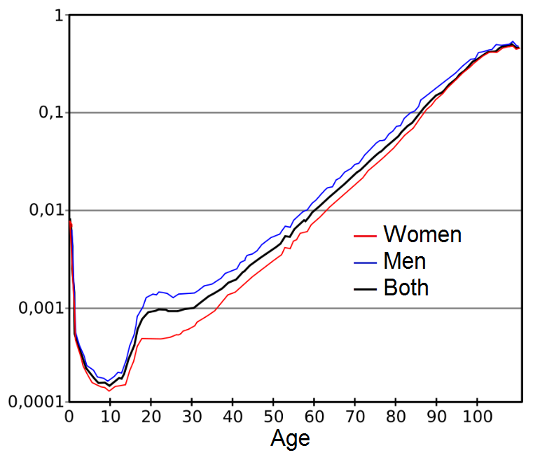
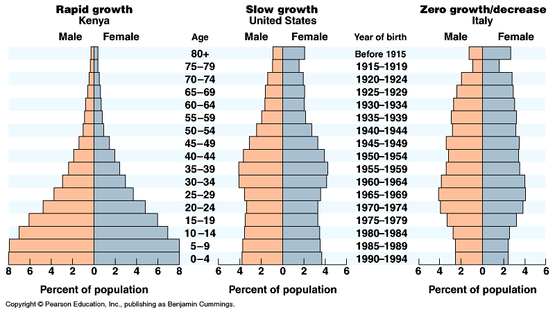

# Introduction {visibility="hidden"}

## {content-align="center" style="font-size: 160%;"}


<center>

**Age-structured and stage-structured <br> population models**
    
{height="2.7cm"}
{height="2.7cm"}
{height="2.7cm"}

</center>


# Introduction


## Motivation

Birth and death rates usually depend on age.

Growth rates will differ between populations with different age
structures.

Some age classes contribute more to population growth than others.

These facts have important management implications.

  

## Human mortality risk
  



## Human age distributions

**Declining populations have relatively more old individuals than growing populations**

<center>

</center>


## Three age class example

Abundance of age class $i$ in year $t$ is denoted by $n_{i,t}$.

The model for $n_{i,t+1}$ depends on: 
  
- Age class survival $s_{i}$, and
- Age class fecundity $f_{i}$
- Fecundity is the birth rate ($b_i$) multiplied by survival
  * In pre-reproductive surveys, $f_i = b_i \times s_0$
  * In post-reproductive surveys, $f_i = b_i \times s_i$
    

## How does this population grow?
  
<center>
::: center
   Age class  Equation
  ----------- ----------------------------------------------------------------------------
       1      $n_{1,t+1} = n_{1,t} \times f_1 + n_{2,t} \times f_2 + n_{3,t} \times f_3$
              $n_{2,t+1} = n_{1,t} \times s_{1}$
              $n_{3,t+1} = n_{2,t} \times s_{2}$
:::
</center>
  
According to this particular age-structured model, all animals die
after spending one time interval in the third age class.
  
In stage-structured models, animals can stay in a class for
more than one time interval. 


## Age-class abundance and age distribution
  
- Suppose initial abundance in the 3 age classes is:
  * $n_{1,1} = 50$ (Age class 1, juveniles)
  * $n_{2,1} = 40$ (Age class 2, subadults)
  * $n_{3,1} = 10$ (Age class 3, adults)
  * $N_1$ = 100
      
- This implies an initial age distribution of:
       
  * $c_{1,1} = n_{1,1}/N_1 = 0.5$
  * $c_{2,1} = n_{2,1}/N_1 = 0.4$
  * $c_{3,1} = n_{3,1}/N_1 = 0.1$
      
  
  
**An age distribution describes the proportion of individuals in each age class**


## Age distribution

```{r}
#| label: struc1
#| include: true
#| echo: false
#| fig-width: 6
#| fig-height: 6
#| out-width: '85%'
#| fig-align: 'center'
barplot(c(0.5, 0.4, 0.1), cex.lab=1.3, cex.names=1.3, cex.main=1.3,
        names=c("Juveniles", "Subadults", "Adults"),
        ylab="Proportion in each age class",
        main="Initial age distribution")
```


## Example

<center> 
Let's choose values of $s_i$ and $f_i$
</center>
  
  ----------- ------------------------- ---------------------- ----------------
   Age class   Initial population size   Survival probability   Fecundity rate
                      $n_{i,1}$                 $s_i$               $f_i$
       1                 50                      0.5                 0.0
       2                 40                      0.6                 0.8
       3                 10                      0.0                 1.7
  ----------- ------------------------- ---------------------- ----------------


## Population size, $n_{i,t$}

```{r}
#| label: proj1
#| include: true
#| echo: false
#| results: 'hide'
#| fig-width: 7
#| fig-height: 6
#| out-width: "80%"
#| fig-align: "center"
T <- 30
N <- matrix(NA, 3, T+1)
N[,1] <- c(50, 40, 10)
phi <- c(0.5, 0.6, 0.0)
gamma <- c(0, 0.8, 1.7)
A <- matrix(c(gamma, phi[1], 0, 0, 0, phi[2], 0), 3, 3, byrow=TRUE)
for(t in 1:T) {
    N[,t+1] <- A %*% N[,t]
}
TT <- matrix(0:T, 1, T+1)
matplot(t(TT), t(N), type="o", pch=16, xlab="Time", ylab="Population size",
        cex.lab=1.3, ylim=c(0, 60), col=c("black", "orange", "purple"))
legend(20, 60, c("Age class 1", "Age class 2", "Age class 3"),
       col=c("black", "orange", "purple"), pch=16, lty=1:3)
```

<!-- <center> -->
<!--   [width=0.85\textwidth]{figure/proj1-1} -->
<!-- </center> -->


## Growth rates, $\lambda_{i,t=n_{i,t}/n_{i,t-1}$}

```{r}
#| label: lambda1
#| echo: false
#| include: true
#| fig-width: 7
#| fig-height: 6
#| out-width: "80%"
#| fig-align: "center"
lambda <- N[,2:(T+1)] / N[,1:T]
matplot(t(lambda), type="o", pch=16,
        xlab="Time", ylab="Population growth rate (lambda)",
        cex.lab=1.3,
        col=c("black", "orange", "purple"))
legend(20, 2.4, c("Age class 1", "Age class 2", "Age class 3"),
       col=c("black", "orange", "purple"), pch=16, lty=1:3)
```

<!-- <center> -->
<!--   [width=0.85\textwidth]{figure/lambda1-1} -->
<!-- </center> -->


## Age distribution, $c_{i,t=n_{i,t}/N_t$}

```{r}
#| label: prop1
#| echo: false
#| include: true
#| fig-width: 7
#| fig-height: 6
#| out-width: "80%"
#| fig-align: "center"
Nt <- colSums(N)
C <- sweep(N, 2, Nt, "/")
matplot(t(TT), t(C), type="o", pch=16, xlab="Time",
        cex.lab=1.3,
        ylab="Proportion in age class",
        col=c("black", "orange", "purple"), ylim=c(0, 1))
legend(20, 1, c("Age class 1", "Age class 2", "Age class 3"),
       col=c("black", "orange", "purple"), pch=16, lty=1:3)
```

<!-- <center> -->
<!--   [width=0.85\textwidth]{figure/prop1-1} -->
<!-- </center> -->


## Important things to note
  
Age distribution converges to a **stable age distribution** when survival and fecundity rates are constant.
  
  
Stable age distribution is the proportion of individuals in each age class when the population converges.
  
Growth rates of each age class differ at first, but converge once the stable age distribution is reached.
  
Asymptotic growth rate is $\lambda$ (without subscript).
  
  
Growth rate at the stable age distribution is the same for all age classes, and it is geometric!


# Matrix Models


## Matrix models
  
Matrix models aren't actually *new* models.
  
They are the same models we have been talking about.
  
  
But, they make it much easier to compute important quantities like $\lambda$ and {\it reproductive value}.


## Matrix models vs life tables

::: {.columns}
::: {.column width="50%"}
**Matrix models**
      
- Age is discrete
- Age class is denoted by $i$
- Each age class can have its own vital rates
      
::: {.column width="50%"}
**Life tables**
      
- Age is continuous
- Actual age is denoted by $x$
- Each age can have its own vital rates

:::
:::

<center>
{width="90%"}
</center>


## What is a matrix?

**Definition**: A matrix is a rectangular array of numbers
  
- Usually denoted by an uppercase, bold letter
- Either square or rounded brackets are used
- Usually, rows are indexed by $i$, columns by $j$
  
Example of a $3 \times 4$ matrix: \par

$$
    { \bf A} =
    \begin{bmatrix}
      a_{1,1} & a_{1,2} & a_{1,3} & a_{1,4} \\
      a_{2,1} & a_{2,2} & a_{2,3} & a_{2,4} \\
      a_{3,1} & a_{3,2} & a_{3,3} & a_{3,4}
    \end{bmatrix}
$$


## Leslie matrix
  
**What is it?**
  
- Square matrix 
- Fecundities on first row
- Survival probs on lower off-diagonal
  
  
Example:
  
<center>
$$
    {\bf A} =
    \begin{bmatrix}
      f_1 & f_2 & f_3 & f_4 \\
      s_1 & 0 & 0 & 0 \\
      0 & s_2 & 0 & 0 \\
      0 & 0 & s_3 & 0
    \end{bmatrix}
$$
</center>


## How do we use a Leslie matrix?
  
These two expressions are equivalent:

   Age class  Equation
  ----------- --------------------------------------------------------------------------------
       1      $n_{1,t+1} = n_{1,t} \times f_{1} + n_{2,t} \times f_{2} + n_{3,t} \times f_3$
       2      $n_{2,t+1} = n_{1,t} \times s_{1}$
       3      $n_{3,t+1} = n_{2,t} \times s_{2}$

AND

$${\bf n}_{t+1} = {\bf A}\times {\bf n}_{t}$$


## Matrix multiplication
  

$$
    \begin{bmatrix}
      aw + bx + cy + dz \\
      ew + fx + gy + hz \\
      iw + jx + ky + lz \\
      mw + nx + oy + pz
    \end{bmatrix}
     =
    \begin{bmatrix}
      a & b & c & d \\
      e & f & g & h \\
      i & j & k & l \\
      m & n & o & p
    \end{bmatrix}
    \times
    \begin{bmatrix}
      w \\
      x \\
      y \\
      z
    \end{bmatrix}
$$


## Matrix multiplication and Leslie matrix
  
$$
    \begin{bmatrix}
      n_{1,t+1} <br>
      n_{2,t+1} <br>
      n_{3,t+1} <br>
      n_{4,t+1}
    \end{bmatrix}
    =
    \begin{bmatrix}
      f_1 & f_2 & f_3 & f_4 <br>
      s_1 & 0 & 0 & 0 <br>
      0 & s_2 & 0 & 0 <br>
      0 & 0 & s_3 & 0
    \end{bmatrix}
    \times
    \begin{bmatrix}
      n_{1,t} <br>
      n_{2,t} <br>
      n_{3,t} <br>
      n_{4,t}
    \end{bmatrix}
$$


# Reproductive value


## Reproductive Value

**Definition**: The extent to which an individual in age class $i$ will contribute to the ancestry of future generations.

$$
    v_i = \sum_{j=i}^{I}\left(\prod_{h=i}^{j-1}s_h\right)f_j\lambda^{i-j-1}
$$
  
Post-reproductive individuals have reproductive values of zero. <br>
  
Depending on survival and fecundity rates, a first-year individual could have a higher or lower reproductive value than a second-year individual. 


## Reproductive value for previous example

%  <center>
```{r}
#| label: rv
#| include: true
#| echo: false
V <- eigen(t(A))$vectors[,1]
rv <- as.numeric(V/V[1])
barplot(rv, names=c("Age class 1", "Age class 2", "Age class 3"),
        ylab="Reproductive value", ylim=c(0, 2), cex.names=1.5,
        cex.lab=1.5)
box()
```


## Other important quantities

**Net reproductive rate**

The expected number of individuals produced by an individual over  its lifetime:

$$
    R_0 = \sum_{i=1}^I \left(\prod_{j=1}^{i-1} s_j\right)f_i
$$
  
  
**Generation time**

The time required for a population to increase by a factor of
$R_0$. 

$$
  T = \frac{\log(R_0)}{\log(\lambda)}
$$


## Other properties of the Leslie matrix^[This is for graduate students only]

The dominant eigenvalue of ${\bf A}$ is the growth rate $\lambda$.
  
The right eigenvector is the {\bf stable age distribution}.
  
The left eigenvector is the {\bf reproductive value}.


# Stage-structured models


## Stage-structured population models
  
%  
%  * Age isn't always the best way to think about population structure. <br>
  % * <2->
  
  
  For some populations, it is much more useful to think about size
      structure or even spatial structure. <br>
      % * <3->
  
  
  These ``stage-structured'' models differ from age-structured models
  in that individuals can remain in a stage class (with
  probability $1-p_i$) for multiple time periods. <br>
%  
%  
  \tikzstyle{level 1} = [circle, draw, text width=0.5cm, minimum size=1.5cm,
  node distance=3cm, text centered, fill=blue!10]
  <center>
   \uncover<4>{
   \begin{tikzpicture}[scale=0.8, every node/.style={scale=0.8}] \footnotesize %
      \node [level 1] (n1) [yshift=-5mm] {$n_{1,t}$};
      \node [level 1, right of=n1] (n2) [yshift=0mm] {$n_{2,t}$};
      \node [level 1, right of=n2] (n3) [yshift=0mm] {$n_{3,t}$};
      \draw[->,thick]  (n1) to node[above] {$s_1$} (n2);
      \draw[->,thick] (n2) to node[above] {$p_2s_2$} (n3);
      \draw[->,thick] (n2) to [bend right=40] node[above] {$f_2$} (n1);
      \draw[->,thick] (n3) to [bend right=60] node[above] {$f_3$} (n1);
      \draw[->,thick] (n2) to [loop below] node[below] {$(1-p_2)s_2$} (n2);
      \draw[->,thick] (n3) to [loop below] node[below] {$s_3$} (n3);
   \end{tikzpicture}
   }
  </center>


%\begin{comment}

  ## Stage-structured population models
  
  {In stage-structured models, individuals transition from one
    stage to the next with probability $p_i$. \par
    
    
    We can add these
    transition probabilities to our projection matrix like this:}
  
  %% 
  %% <center>
  %%   \[
  %%   {\bf A} =
  %%   \begin{bmatrix}
  %%     f_1 & f_2 & f_3 & f_4 <br>
  %%     s_1 & s_2(1-p_2) & 0 & 0 <br>
  %%     0 & s_2 p_2 & s_3(1-p_3) & 0 <br>
  %%     0 & 0 & s_3p_3 & s_4
  %%   \end{bmatrix}
  %%   \]
  %% </center>
  <center>
    
    \[
    {\bf A} =
    \begin{bmatrix}
      f_1 & f_2 & f_3 <br>
      s_1 & s_2(1-p_2) & 0 <br>
      0 & s_2 p_2 & s_3
    \end{bmatrix}
    \]
  </center>


This example allows for individual to remain in stages 2 and 3 for 
more than one time period.

%\end{comment}


  ## Summary
%  [<+->]
%  * Vital rates ($s$ and $f$) are usually age-specific. <br>
  
  
  % * Population growth will depend on age distribution. <br>
  
  
  % * If vital rates are constant, population will reach stable
  age distribution with constant growth rate $\lambda$. <br>
  
  
  % * Reproductive value indicates which age class contributes the
  most to population growth. <br>
  
  
  % * Matrix models are a convenient method used to work with
  age-structured populations. <br>
%  


\begin{comment}

# Sensitivity analysis


  ## Sensitivity analysis
  {\bf Questions}
  
    * How will $\lambda$ change if we change $b$ or $d$?
  


%\begin{comment}
# Life Tables


  ## Scenario
  
  
    * Age ($x$) begins at 0, ends at $k$
    * The age class ($i$) begins at 1, and ends at $s=k-1$
  
  <center>
    [width=0.6\textwidth]{figs/age-class-diagram}
  </center>
  
  
    * Individuals either advance to the next age class or die
    * An age class is not necessarily a 1 year time period
    * Each age class has its own vital rates
    * We usually only care about females
  


  ## Life Tables
  {\bf Assumptions}
  [(1)]
    * Birth-pulse model
      
        * Individuals give birth on day they enter new age class
      
    * Postbreeding census
  


  ## Life Tables
  <center>
    \begin{tabular}{cccccc}
      \hline
      Age ($x$) & Age class ($i$) & $b_x$ & $s_i$ & $l_x$         & $F_i$       <br>
      \hline
      0         &                 & 0     &          & 1.0          & <br>
      1         & 1               & 0.8   & 0.7      & $s_1$=0.7 & $b_1s_1$ <br>
      2         & 2               &       & 0.7      & $s_1s_2$=   & <br>
      \hline
    \end{tabular}
  </center>
  
    * [] $b_x$ is the average number of offspring produced by an
      individual of age $x$
    * [] $l_x$ is the probability of surviving from age 0 to age $x$
  


\note{Euler-Lotka equation: After stable age distribution is attained,
the population grows at a constant rate that is given by the solution
of the E-L equation. }


%% 
%%   ## Life tables in reverse
%%   \note{On the assumption that the population is (1) at a stable age
%%     distribution and (2) stationary (i.e. $\lambda$=1, it may be
%%     possible to use the standing age distribution to calculate
%%     age-specific survival rates}
%%   \note{In general, it is not possible to use age frequency data alone
%%     to both estimate age-specific survival and to test the assumptions
%%     of age stability and stationarity.}

%% 


\end{comment}


