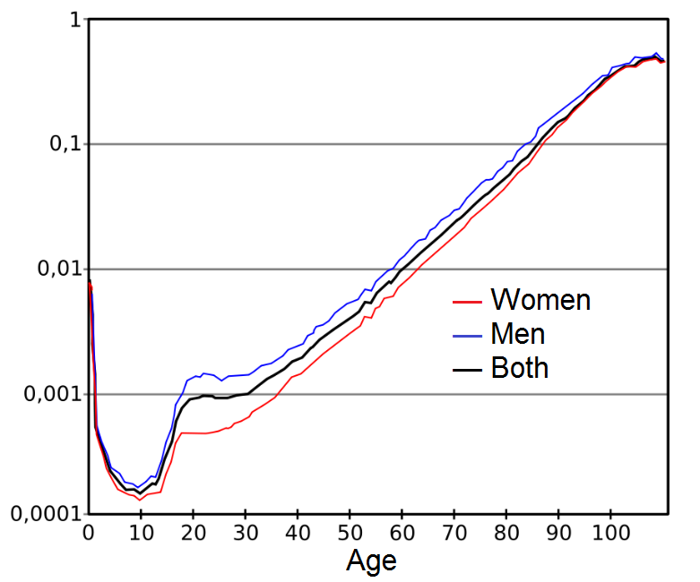
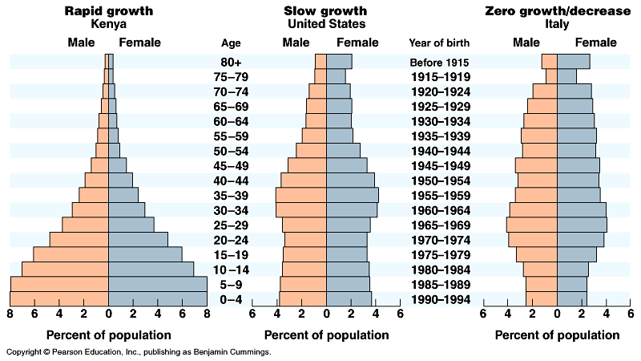
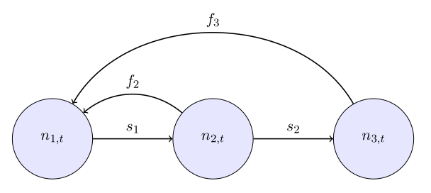
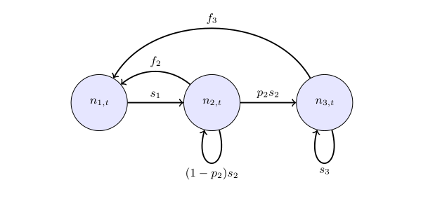

# Introduction {visibility="hidden"}

## {content-align="center" style="font-size: 160%;"}


<center>

**Age-structured and stage-structured <br> population models**

<br>

{height="7cm"}
{height="7cm"}
{height="7cm"}

</center>


## Motivation

<br>

::: {style='font-size: 90%;'}
Birth and death rates usually depend on age.

<br>

::: {.fragment}
Growth rates will differ between populations with different age
structures.
:::

<br>

::: {.fragment}
Some age classes contribute more to population growth than others.
:::

<br>

::: {.fragment}
These facts have important management implications.
:::

:::


## Human mortality risk

<center>

{height="15cm"}

</center>


## Human age distributions

::: {style='font-size: 70%;'}
**Declining populations have relatively more old individuals than growing populations.**
:::

<br>

<center>

</center>


## Three age class example

::: {style='font-size: 70%;'}

Abundance of age class $i$ in year $t$ is denoted by $n_{i,t}$.

::: {.fragment}
The model for $n_{i,t+1}$ depends on: 

- Age class survival $s_{i}$, and
- Age class fecundity $f_{i}$
- Fecundity is the birth rate ($b_i$) multiplied by survival
  * In pre-reproductive surveys, $f_i = b_i \times s_0$
  * In post-reproductive surveys, $f_i = b_i \times s_i$
:::

:::

::: {.fragment}

<center>
{width="50%"}
</center>


```{mermaid}
%%| label: "age-diagram"
%%| fig-align: "center"
%%| fig-width: 5
%%| include: false
---
config:
  flowchart:
    nodeSpacing: 50
    rankSpacing: 50
    padding: 15
  theme: forest
  layout: elk
  elk:
    nodePlacementStrategy: LINEAR_SEGMENTS
    nodePlacementAlignment: NONE
---
flowchart LR
  n1(("$$n_{1,t}$$")) --> n2(("$$n_{2,t}$$")) --> n3(("$$n_{3,t}$$"))
  n2 --> n1
  n3 --> n1
```
:::

## How does this population grow?
  
::: {style='font-size: 80%;'}

  Age class |  Equation
  -------------- | ---------------------------------------------------
       1   |   $n_{1,t+1} = n_{1,t} \times f_1 + n_{2,t} \times f_2 + n_{3,t} \times f_3$
       2   |   $n_{2,t+1} = n_{1,t} \times s_{1}$
       3   |   $n_{3,t+1} = n_{2,t} \times s_{2}$


<br>

::: {.fragment}
According to this particular age-structured model, all animals die
after spending one time interval in the third age class.
:::

<br>
  
::: {.fragment}
In stage-structured models, animals can stay in a class for
more than one time interval. 
:::

:::


## [Age-class abundance and age distribution]{style="font-size: 90%;"}

::: {style='font-size: 80%;'}

- Suppose initial abundance in the 3 age classes is:
  * $n_{1,1} = 50$ (Age class 1, juveniles)
  * $n_{2,1} = 40$ (Age class 2, subadults)
  * $n_{3,1} = 10$ (Age class 3, adults)
  * $N_1$ = 100

::: {.fragment}
- This implies an initial age distribution of:

  * $c_{1,1} = n_{1,1}/N_1 = 0.5$
  * $c_{2,1} = n_{2,1}/N_1 = 0.4$
  * $c_{3,1} = n_{3,1}/N_1 = 0.1$
:::

::: {.fragment}

<center>
**An age distribution describes the proportion of individuals in each age class**
</center>

:::

:::


## Age distribution

```{r}
#| label: struc1
#| include: true
#| echo: false
#| fig-width: 9
#| fig-height: 7
#| out-width: '95%'
#| fig-align: 'center'
barplot(c(0.5, 0.4, 0.1), cex.lab=1.3, cex.names=1.3, cex.main=1.3,
        names=c("Juveniles", "Subadults", "Adults"),
        ylab="Proportion in each age class",
        main="Initial age distribution")
```


## Example

<center> 
Let's choose values of $s_i$ and $f_i$
</center>

<br>

::: {style='font-size: 80%;'}

  ----------- ------------------------- ---------------------- ----------------
   Age class   Initial population size   Survival probability   Fecundity rate
                      $n_{i,1}$                 $s_i$               $f_i$
       1                 50                      0.5                 0.0
       2                 40                      0.6                 0.8
       3                 10                      0.0                 1.7
  ----------- ------------------------- ---------------------- ----------------

:::


## Population size, *n~i,t~*

```{r}
#| label: proj1
#| include: true
#| echo: false
#| results: 'hide'
#| fig-width: 9
#| fig-height: 7
#| out-width: "100%"
#| fig-align: "center"
T <- 30
N <- matrix(NA, 3, T+1)
N[,1] <- c(50, 40, 10)
phi <- c(0.5, 0.6, 0.0)
gamma <- c(0, 0.8, 1.7)
A <- matrix(c(gamma, phi[1], 0, 0, 0, phi[2], 0), 3, 3, byrow=TRUE)
for(t in 1:T) {
    N[,t+1] <- A %*% N[,t]
}
TT <- matrix(0:T, 1, T+1)
matplot(t(TT), t(N), type="o", pch=16, xlab="Time", ylab="Population size",
        cex.lab=1.3, ylim=c(0, 60), col=c("black", "orange", "purple"))
legend(20, 60, c("Age class 1", "Age class 2", "Age class 3"),
       col=c("black", "orange", "purple"), pch=16, lty=1:3)
```


## Growth rates, *lambda~i,t~=n~i,t~/n~i,t-1~*

```{r}
#| label: lambda1
#| echo: false
#| include: true
#| fig-width: 9
#| fig-height: 7
#| out-width: "90%"
#| fig-align: "center"
lambda <- N[,2:(T+1)] / N[,1:T]
matplot(t(lambda), type="o", pch=16,
        xlab="Time", ylab="Population growth rate (lambda)",
        cex.lab=1.3,
        col=c("black", "orange", "purple"))
legend(20, 2.4, c("Age class 1", "Age class 2", "Age class 3"),
       col=c("black", "orange", "purple"), pch=16, lty=1:3)
```


## Age distribution, *c~i,t~=n~i,t~/N~t~*

```{r}
#| label: prop1
#| echo: false
#| include: true
#| fig-width: 9
#| fig-height: 7
#| out-width: "100%"
#| fig-align: "center"
Nt <- colSums(N)
C <- sweep(N, 2, Nt, "/")
matplot(t(TT), t(C), type="o", pch=16, xlab="Time",
        cex.lab=1.3,
        ylab="Proportion in age class",
        col=c("black", "orange", "purple"), ylim=c(0, 1))
legend(20, 1, c("Age class 1", "Age class 2", "Age class 3"),
       col=c("black", "orange", "purple"), pch=16, lty=1:3)
```


## Important things to note
  
::: {style='font-size: 75%;'}
Age distribution converges to a **stable age distribution** when survival and fecundity rates are constant.

<br>

::: {.fragment}
Stable age distribution is the proportion of individuals in each age class when the population converges.
:::
  
<br>

::: {.fragment}
Growth rates of each age class differ at first, but converge once the stable age distribution is reached.
:::
  
<br>

::: {.fragment}
Asymptotic growth rate is $\lambda$ (without subscript).
:::

<br>

::: {.fragment}
Growth rate at the stable age distribution is the same for all age classes, and it is geometric!
:::

:::


# Matrix Models


## Matrix models
  
Matrix models aren't actually *new* models.

<br>

They are the same models we have been talking about.
  
<br>

::: {.fragment}
But, they make it much easier to compute important quantities like $\lambda$ and *reproductive value*.
:::


## Matrix models vs life tables

::: {style='font-size: 75%;'}
::: {.columns}
::: {.column width="50%"}
**Matrix models**
      
- Age is discrete
- Age class is denoted by $i$
- Each age class can have its own vital rates
:::

::: {.column width="50%"}
**Life tables**
      
- Age is continuous
- Actual age is denoted by $x$
- Each age can have its own vital rates

:::
:::
:::

<center>
{width="70%"}
</center>


## What is a matrix?

::: {style='font-size: 80%;'}
**Definition**: A matrix is a rectangular array of numbers
  
- Usually denoted by an uppercase, bold letter
- Either square or rounded brackets are used
- Usually, rows are indexed by $i$, columns by $j$
  
Example of a $3 \times 4$ matrix: \par

$$
    { \bf A} =
    \begin{bmatrix}
      a_{1,1} & a_{1,2} & a_{1,3} & a_{1,4} \\
      a_{2,1} & a_{2,2} & a_{2,3} & a_{2,4} \\
      a_{3,1} & a_{3,2} & a_{3,3} & a_{3,4}
    \end{bmatrix}
$$
:::


## Leslie matrix
  
::: {style='font-size: 80%;'}
**What is it?**
  
- Square matrix 
- Fecundities on first row
- Survival probs on lower off-diagonal
  
  
Example:
  
<center>
$$
    {\bf A} =
    \begin{bmatrix}
      f_1 & f_2 & f_3 & f_4 \\
      s_1 & 0 & 0 & 0 \\
      0 & s_2 & 0 & 0 \\
      0 & 0 & s_3 & 0
    \end{bmatrix}
$$
</center>
:::


## How do we use a Leslie matrix?
  
::: {style='font-size: 80%;'}
These two expressions are equivalent:

   Age class | Equation
  -------------- | -------------------------------------------------------
       1  |    $n_{1,t+1} = n_{1,t} \times f_{1} + n_{2,t} \times f_{2} + n_{3,t} \times f_3$
       2  |    $n_{2,t+1} = n_{1,t} \times s_{1}$
       3  |    $n_{3,t+1} = n_{2,t} \times s_{2}$

AND

$${\bf n}_{t+1} = {\bf A}\times {\bf n}_{t}$$

:::


## Matrix multiplication

<br>

$$
    \begin{bmatrix}
      aw + bx + cy + dz \\
      ew + fx + gy + hz \\
      iw + jx + ky + lz \\
      mw + nx + oy + pz
    \end{bmatrix}
     =
    \begin{bmatrix}
      a & b & c & d \\
      e & f & g & h \\
      i & j & k & l \\
      m & n & o & p
    \end{bmatrix}
    \times
    \begin{bmatrix}
      w \\
      x \\
      y \\
      z
    \end{bmatrix}
$$


## [Matrix multiplication and Leslie matrix]{style="font-size: 90%;"}
  
$$
    \begin{bmatrix}
      n_{1,t+1} \\
      n_{2,t+1} \\
      n_{3,t+1} \\
      n_{4,t+1}
    \end{bmatrix}
    =
    \begin{bmatrix}
      f_1 & f_2 & f_3 & f_4 \\
      s_1 & 0 & 0 & 0 \\
      0 & s_2 & 0 & 0 \\
      0 & 0 & s_3 & 0
    \end{bmatrix}
    \times
    \begin{bmatrix}
      n_{1,t} \\
      n_{2,t} \\
      n_{3,t} \\
      n_{4,t}
    \end{bmatrix}
$$


# Reproductive value


## Reproductive Value

::: {style='font-size: 80%;'}
**Definition**: The extent to which an individual in age class $i$ will contribute to the ancestry of future generations.

$$
    v_i = \sum_{j=i}^{I}\left(\prod_{h=i}^{j-1}s_h\right)f_j\lambda^{i-j-1}
$$

<br>

::: {.fragment}
Post-reproductive individuals have reproductive values of zero.
:::
  
<br>

::: {.fragment}
Depending on survival and fecundity rates, a first-year individual could have a higher or lower reproductive value than a second-year individual. 
:::

:::


## [Reproductive value for previous example]{style="font-size: 80%;"}

```{r}
#| label: rv
#| include: true
#| echo: false
#| fig-width: 9
#| fig-height: 7
#| out-width: "90%"
#| fig-align: center
V <- eigen(t(A))$vectors[,1]
rv <- as.numeric(V/V[1])
barplot(rv, names=c("Age class 1", "Age class 2", "Age class 3"),
        ylab="Reproductive value", ylim=c(0, 2), cex.names=1.5,
        cex.lab=1.5)
box()
```


## Other important quantities

::: {style='font-size: 80%;'}
**Net reproductive rate**

The expected number of individuals produced by an individual over its lifetime:

$$
    R_0 = \sum_{i=1}^I \left(\prod_{j=1}^{i-1} s_j\right)f_i
$$
  
  
::: {.fragment}
**Generation time**

The time required for a population to increase by a factor of $R_0$.

$$
  T = \frac{\log(R_0)}{\log(\lambda)}
$$
:::

:::


## Other properties of the Leslie matrix


The dominant eigenvalue of ${\bf A}$ is the growth rate $\lambda$.

<br>

The right eigenvector gives the **stable age distribution**.

<br>

The left eigenvector gives the **reproductive value**.


# Stage-structured models


## Stage-structured population models
  
::: {style='font-size: 80%;'}
Age isn't always the best way to think about population structure.

::: {.fragment}
For some populations, it is much more useful to think about size structure or even spatial structure.
:::

::: {.fragment}
These "stage-structured" models differ from age-structured models in that individuals can remain in a stage class (with probability $1-p_i$) for multiple time periods.
:::

:::


::: {.fragment}

<center>
{width="70%"}
</center>

```{dot}
//| label: "stage-diagram"
//| fig-align: "center"
//| fig-width: 7
//| out-width: "80%"
//| include: false
digraph age_structured_model {
    rankdir=LR;
    node [shape=circle, style=filled, fillcolor=lightblue, fontname="Helvetica", fontsize=12];
    edge [fontname="Helvetica", fontsize=10];

    // Define age classes (stages/compartments)
    Age1 [label="Age 1\n(N₁)", fillcolor="#a8d5ba"];
    Age2 [label="Age 2\n(N₂)", fillcolor="#f1c40f"];
    Age3 [label="Age 3\n(N₃)", fillcolor="#e74c3c", fontcolor=white];

    // Sinks / Dead state (optional, for clarity on mortality)
    // Dead [label="Mortality", shape=point, style=invis];

    // Transitions (Aging / Survival)
    Age1 -> Age2 [label="σ₁ (Survival)"];
    Age2 -> Age3 [label="σ₂ (Survival)"];

    // Mortality / Outflows (Optional visual cues)
    // Age1 -> Dead [label="μ₁"];
    // Age2 -> Dead [label="μ₂"];
    // Age3 -> Dead [label="μ₃"];

    // Reproduction / Births (looping back to Age 1)
    Age2 -> Age1 [label="F₂ (Fecundity)", color=purple, fontcolor=purple, constraint=false];
    Age3 -> Age1 [label="F₃ (Fecundity)", color=purple, fontcolor=purple, constraint=false];
    
    // Self-loop for Age 3 if they stay in the final class (e.g., plus-group)
    Age3 -> Age3 [label="σ₃ (Retain)", tailport=ne, headport=nw];
}

```
:::


<!-- ::: {.fragment} -->
<!-- ```{mermaid} -->
<!-- %%| label: "stage-diagram" -->
<!-- %%| fig-align: "center" -->
<!-- --- -->
<!-- config: -->
<!--   theme: default -->
<!--   look: classic -->
<!--   layout: dagre -->
<!-- --- -->
<!-- flowchart LR -->
<!--   n1(("$$n_{1,t}$$"))-- "$$s_1p_1$$" -\-> n2(("$$n_{2,t}$$"))-- "$$s_2p_2$$" -\-> n3(("$$n_{3,t}$$")) -->
<!--   n2 -\-> n2 -->
<!-- ``` -->
<!-- ::: -->


## Stage-structured population models
  
::: {.fragment}
In stage-structured models, individuals transition from one stage to the next with probability $p_i$.

::: {.fragment}
We can add these transition probabilities to our projection matrix like this:

$$
{\bf A} =
  \begin{bmatrix}
    f_1 & f_2 & f_3 \\
    s_1 & s_2(1-p_2) & 0 \\
    0 & s_2 p_2 & s_3
  \end{bmatrix}
$$
:::


::: {.fragment}
This example allows for individual to remain in stages 2 and 3 for  more than one time period.
:::

:::


## Summary

::: {style='font-size: 80%;'}

Vital rates ($s$ and $f$) are usually age-specific.

<br>

::: {.fragment}
Population growth will depend on age distribution.
:::
  
<br>

::: {.fragment}
If vital rates are constant, population will reach stable age distribution with constant growth rate $\lambda$.
:::

<br>

::: {.fragment}
Reproductive value indicates which age class contributes the most to population growth.
:::

<br>

::: {.fragment}
Matrix models are a convenient method used to work with age-structured populations.
:::

:::
