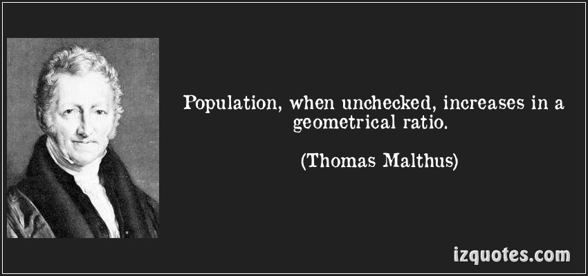
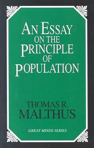
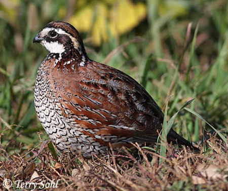
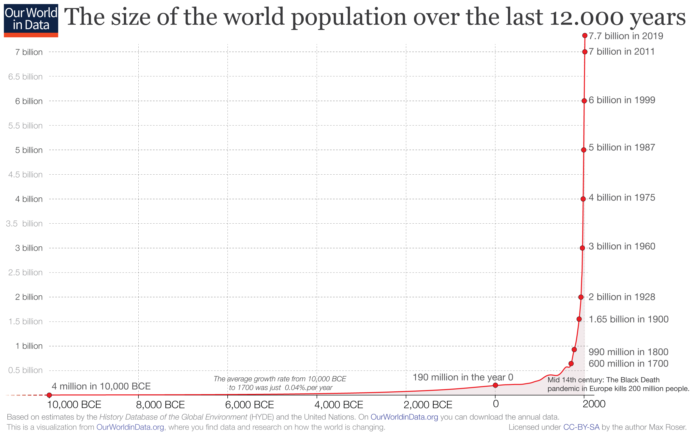

# Background and Review {visibility="hidden"}

## {content-align="center" style="font-size: 180%;" background-image="figs/doves.jpg" background-opacity=0.2}

Geometric and Exponential Growth

 

::: {style="font-size: 80%;"}
Applied Population Dynamics\
WILD 5700/7700
:::

## Today's learning objectives

The equations for geometric and exponential growth.

 

The relationship between geometric growth and the BIDE model.

 

The difference between continuous and discrete time models of
population growth.

 

The definition of density *independent* population growth.

## What is Population Dynamics?

The study of spatial and temporal variation in population size and
structure. 

## Fundamental Question {style="font-size: 90%;"}

How does abundance go from $N_t$ to $N_{t+1}$?

 

::: {.fragment fragment-index=1}
Answer: The [BIDE]{style="color: red;"} Model 
:::

::: {.fragment fragment-index=1}
$$N_{t+1} = N_t + B_t + I_t - D_t - E_t$$

B=Births, I=Immigrations, D=Deaths, E=Emigrations
:::

 

::: {.fragment fragment-index=2}
Geometric growth is a simplification of BIDE.
:::

 
  
::: {.fragment fragment-index=3}
Exponential growth is a continuous time version of geometric growth.
:::

# Geometric Growth

## Reverend Thomas Malthus, 1766--1834

{height="350"}
{height="350"}

## Relevance To Wildlife Biology and Management

 

Charles Darwin *Origin of Species*

> There is no exception to the rule that every organic being increases
> at so high a rate, that if not destroyed, the earth would soon be
> covered by the progeny of a single pair.
  
. . .

> Hence, as more individuals are produced than can possibly survive,
> there must in every case be a struggle for existence...

## Aldo Leopold, Game Management 1946 {style="font-size: 80%;"}

::: {.columns}

::: {.column width='90%'}

> Every wild species has certain fixed habits which govern the reproductive process, and determine its maximum rate. Thus one pair of quail, if entirely unmolested in an "ideal" environment, would increase at this rate:

  At End of                Young   Adults   Total
  ----------- -- --------------- -------- -------
  1st year                    14        2      16
  2nd year          (16/2)14=112       16     128
  3rd year         (128/2)14=896      128    1024

::: {.fragment}
> The maximum rate of increase is of course never attained in nature. Part of it never takes place, part of it is absorbed by natural enemies, and part of it absorbed by hunters.
:::

:::

::: {.column width='10%'}

{width="100%"} 

{width="100%"}

:::

:::

## So What Is Geometric Growth?

 

For an arbitrary time step ($t$):

$$N_t = N_0(1+r)^t$$

::: {.fragment}
Or, for one time step:

$$N_{t+1} = N_t + N_tr$$
:::

$r$ = discrete-time version of intrinsic rate of increase

## Example, $N_{t+1} = N_t + N_t r$

<!-- ::: columns[] -->
<!-- ::: {.column width='50%'} -->
<!--       
 -->
<!--         $N_0 = 3$, $r=1$ -->
<!--         \small -->
<!--         \begin{tabular}{cc} -->
<!--           \hline -->
<!--           Time & Population size \\ -->
<!--           ($t$) & ($N_t$) \\ -->
<!--           \hline -->
<!--           0 & 3  \\ -->
<!--           \visible<2->{1 & 6}  \\ -->
<!--           \visible<3->{2 & 12} \\ -->
<!--           \visible<4->{3 & 24} \\ -->
<!--           \visible<5->{4 & 48} \\ -->
<!--           \visible<6->{5 & 96} \\ -->
<!--           \visible<7->{6 & 192} \\ -->
<!--           \visible<8->{7 & 384} \\ -->
<!--           \visible<9->{8 & 768} \\ -->
<!--           \visible<10->{9 & 1536} \\ -->
<!--           \visible<11->{10 & 3072} \\ -->
<!--           \hline -->
<!--         \end{tabular} -->
<!--       
 -->
<!--     ::: -->
<!--     ::: {.column width='50%'} -->
<!--       <1 | handout:0> %\\ -->
<!--       <2 | handout:0> %\\ -->
<!--       <3 | handout:0> %\\ -->
<!--       <4 | handout:0> %\\ -->
<!--       <5 | handout:0> %\\ -->
<!--       <6 | handout:0> %\\ -->
<!--       <7 | handout:0> %\\ -->
<!--       <8 | handout:0> %\\ -->
<!--       <9 | handout:0> %\\ -->
<!--       <10 | handout:0>  -->
<!--       <11> \\ -->
<!--     ::: -->
<!--   ::: -->

## Three Possible Outcomes, $N_{t+1} = N_t + N_t r$

::: columns
::: {.column width='50%'}

If $-1 \leq r < 0$ population goes extinct

:::
::: {.column width='50%'}

If $r = 0$ population is stable

:::
::: {.column width='50%'}

If $r > 0$ population grows to $\infty$
      

:::
:::

# Connection to BIDE

## From [BIDE]{.highlight-red} To Geometric Growth

**Fundamental equation of population ecology**

$$N_{t+1} = N_t + B_t + I_t - D_t - E_t$$

::: {.plain}

|         |   |                       |
|---------|---|-----------------------|
|  $N_t$  | = | Abundance at year $t$ |
|  $B$    | = | Births |
|  $I$    | = | Immigrations |
|  $D$    | = | Deaths |
|  $E$    | = | Emigrations |

:::

## From [BIDE]{.highlight-red} To Geometric Growth

  Ignore immigration and emigration
  $$N_{t+1} = N_t + B_t - D_t$$

  ------- --- -----------------------
   $N_t$   =  Abundance in year $t$
    $B$    =  Births
    $D$    =  Deaths
  ------- --- -----------------------

## From [BIDE]{.highlight-red} To Geometric Growth

**Step 1**: Divide both sides by $N_{t}$

**Step 2**: Write in terms of \textit{per capita} birth and death *rates*

$$
\frac{N_{t+1}}{N_{t}} \quad  &= \quad  1 + b - d \\ 
                      \quad  &= \quad  1 + r} \\
                      \quad  &= \quad  \lambda
$$

**Step 3**: Geometric growth

$$N_{t+1} = N_t + N_tr$$

Note that $\lambda = N_{t+1}/N_t = 1+r$.

# Exponential Growth

## Density Independent Growth

**Geometric and exponential growth are examples of [density independent]{.alert} growth**.

 
  
**Definition**: Population growth rate ($r$) is *not* affected b
population size ($N$).

 
  
**Implications**:  Resources are unlimited and there is no carrying capacity!

## Model Assumptions
  
Population is geographically closed

- No immigration
- No emigration
    
Reproduction occurs seasonally (for geometric growth)

 -Constant birth rate ($b$) and death rate ($d$)

- No genetic variation among individuals
 
- No age- or stage-structure
 
- No time lags
      
No stochasticity

- No random variation in birth or death 
- No random variation in environmental conditions

  

## Can We Apply The Model To Real Data?

> All models are wrong, but some are useful. (George Box)
  
Is exponential growth a useful model?

. . .

Possibly for describing some populations during short time periods, e.g. invasive species

Also useful as foundation for more realistic models
  
  
{fig-align="center"}

## Looking Ahead

Is the human population exhibiting exponential growth?
  
{fig-align="center"
width="80%"}

[Our world in data](https://ourworldindata.org/world-population-growth)

## Assignment {style="font-size: 150%;"}

 

Read pages 15--19 in Conroy and Carroll

 

Be prepared for a quiz

