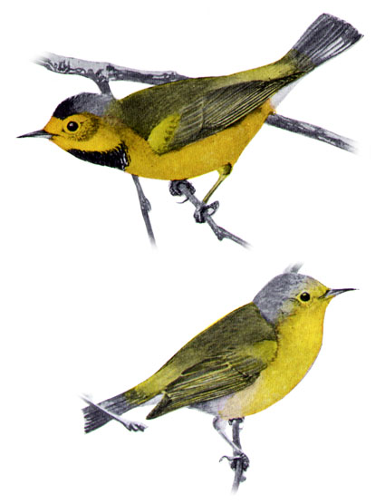

# Introduction {visibility="hidden"}

## {content-align="center" style="font-size: 160%;"}


<center>

Extinction
	
<br>
    
{height="4.5in"}
{height="4.5in"}

</center>


## Today in APD

<br>

Recent extinctions

<br>

Time-to-extinction

<br>

Extinction risk

<br>

Allee efffects


## Extinction

::: {.incremental style='font-size: 80%;'}

<center>
[](https://vimeo.com/42592260)
<!-- [Hawaiian Bird Extinctions](https://vimeo.com/42592260) -->
<!-- http://www.discovery.com/tv-shows/racing-extinction/the-song-of-the-last-kauai-oo-bird/ -->
</center>


* Humans are causing the 6th mass extinction event.
* At least 1000 species have gone extinct over past 500 years.
* Extinction rate appears to be 100-1000 times higher than during the past 25 million years before humans.
* Almost 200 bird species have gone extinct since 1500.
* Avian extinctions in GA: passenger pigeon, Bachman's warbler, ivory-billed woodpecker, Carolina parakeet.
:::
  


<!-- \begin{comment} -->

<!--   ##  -->
<!-- BBC series -- Extinction: The Facts -->
<!-- % {https://www.bbc.co.uk/programmes/p08rg347} % overview -->
<!--   \url{ -->
<!--     https://www.bbc.co.uk/programmes/p08qy8lr % brief overview -->
<!--   } -->
<!--   \url{ -->
<!--     https://www.bbc.co.uk/programmes/p08qym98 % vortex -->
<!--   } -->
<!--   \url{ -->
<!--     https://www.bbc.co.uk/programmes/p08qy8lz % last white rhino -->
<!--   } -->
<!--   \url{ -->
<!--     https://www.bbc.co.uk/programmes/p08qym6s % giraffe -->
<!--   } -->
<!-- Hawaii -->
<!--   \url{ -->
<!--     https://vimeo.com/42592260 %  -->
<!--   } -->
<!--   \url{ -->
<!--     https://youtu.be/J0UlrJeW8n8 % Hawaii birds -->
<!--   } -->

<!-- \end{comment} -->


# Deterministic Models {visibility="hidden"}


## Time to extinction *T~e~*
  
::: {style='font-size: 80%;'}
For a deterministic model, *time to extinction* can be calculated easily. 

<br>
   
But how should we define extinction?

<br>
   
**Time to quasi-extinction** ($T_e$) is the time it takes for a population to reach an extinction threshold beyond which it is doomed. 

<br>
   
Threshold is usually based on genetic considerations, Allee effects, ...
:::


## Geometric growth example

```{r}
#| label: exp1
#| include: true
#| echo: false
#| fig-width: 8
#| fig-height: 6
#| fig-align: center
T <- 50
N <- integer(T+1)
N[1] <- 50
for(t in 1:T) {
    N[t+1] <- N[t] + N[t]*-0.1
}
plot(0:T, N, type="l", col="black", pch=16,
##     xlab="Time", ylab="Superb owl population size", cex.lab=1.3)
     xlab="Time", ylab="Population size", cex.lab=1.3)
abline(h=2, col="red", lwd=2)
text(5, 2, "N=2", pos=3)
Te <- (0:T)[which.max(N<2)]
text(Te-1, 20, paste("Time to quasi-extinction Te =", Te-1))
arrows(Te-1, 19, Te-1, 3, length=0.1)
```


# Stochastic Models {visibility="hidden"}


## Extinction risk
  
::: {style='font-size: 80%;'}
For stochastic models, we are interested in *extinction risk*. 

<br>
  
Extinction risk is the *probability* that a species goes extinct in some time period. 

<br>
   
Extinction risk can be calculated as the proportion of simulations in which the population goes extinct. 
  
<br>

Calculating extinction risk requires a specification of the time horizon of interest.
:::


## Logistic growth with stochastic carrying capacity
  

$$
  N_{t+1} = N_t + N_tr_{max}(1 - N_t/K_t)
$$


where

$$
  K_t \sim \mbox{Normal}(\bar{K}, \sigma^2)
$$


## Logistic example

::: {style='font-size: 60%;'}
$$
  N_{t+1} = N_t + N_t 0.3(1 - N_t/K_t) \\
  K_t \sim \mbox{Normal}(\bar{K}=100, \sigma^2=400)
$$
:::


```{r}
#| label: logistic
#| include: false
#| echo: false
## #| fig-width: 8
## #| fig-height: 6
r.max <- 0.3
K.bar <- 100
sigma.d <- 20
T <- 20
set.seed(4450)
##plot(0:T, N, type="b", xlab="Time", ylab="Population size (N)",
##     ylim=c(0, 300))
nSim <- 100
N <- Nlr <- matrix(NA, T+1, nSim)
N[1,] <- Nlr[1,] <- 25
Te <- integer(nSim)
## if(!dir.exists("figs/lg-d"))
##     dir.create("figs/lg-d")
for(i in 1:nSim) {
    ## fl <- paste("figs/lg-d/lg-d", i, ".pdf", sep="")
    for(t in 1:T) {
        K.t <- rnorm(1, K.bar, sigma.d)
        N[t+1,i] <- N[t,i] + N[t,i]*r.max*(1 - N[t,i]/K.t)
        N[t+1,i] <- N[t+1,i]*(N[t+1,i]>0)
        Nlr[t+1,i] <- Nlr[t,i] + Nlr[t,i]*r.max*(1 - Nlr[t,i]/K.bar)
    }
    if(i < 11 || i==nSim) {
        ## pdf(fl, width=8, heigh=6)
        par(mai=c(0.9,0.9,0.3,0.3))
        mn <- ifelse(i==nSim, paste(nSim, "Simulations"), "")
        matplot(0:T, N, type="l", xlab="Time", ylab="Population size (N)", main=mn,
             ylim=c(0, 150), col=gray(0.7), lty=1, cex.lab=1.5)
        lines(0:T, Nlr[,1], col="blue", lwd=3)
        ext <- N[,i]==0
        if(any(ext)) {
            Te[i] <- min(which(ext))
            points(Te[i], 0, pch=16, col="orange")
        }
        abline(h=0, col="red", lwd=2)
        ## dev.off()
    }
}
```


<center>
::: {.r-stack}
::: {.fragment .fade-out fragment-index=1}
  {width="90%"}
:::
::: {.fragment .fade-in-then-out fragment-index=1}
  {width="90%"}
:::
::: {.fragment .fade-in-then-out fragment-index=2}
  {width="90%"}
:::
::: {.fragment .fade-in-then-out fragment-index=3}
  {width="90%"}
:::
::: {.fragment .fade-in-then-out fragment-index=4}
  {width="90%"}
:::
::: {.fragment .fade-in-then-out fragment-index=5}
  {width="90%"}
:::
::: {.fragment .fade-in-then-out fragment-index=6}
  {width="90%"}
:::
::: {.fragment .fade-in-then-out fragment-index=7}
  {width="90%"}
:::
::: {.fragment .fade-in-then-out fragment-index=8}
  {width="90%"}
:::
::: {.fragment .fade-in-then-out fragment-index=9}
  {width="90%"}
:::
:::
</center>


<!-- <center> -->
<!--   <1 | handout:0>[width=\textwidth]{figs/lg-d/lg-d1} -->
<!--   <2 | handout:0>[width=\textwidth]{figs/lg-d/lg-d2} -->
<!--   <3 | handout:0>[width=\textwidth]{figs/lg-d/lg-d3} -->
<!--   <4 | handout:0>[width=\textwidth]{figs/lg-d/lg-d4} -->
<!--   <5 | handout:0>[width=\textwidth]{figs/lg-d/lg-d5} -->
<!--   <6 | handout:0>[width=\textwidth]{figs/lg-d/lg-d6} -->
<!--   <7 | handout:0>[width=\textwidth]{figs/lg-d/lg-d7} -->
<!--   <8 | handout:0>[width=\textwidth]{figs/lg-d/lg-d8} -->
<!--   <9 | handout:0>[width=\textwidth]{figs/lg-d/lg-d9} -->
<!--   <10>[width=\textwidth]{figs/lg-d/lg-d100} -->
<!-- </center> -->


## Extinction risk

Zero extinctions in 100 simulations, hence extinction risk is (approximately) zero over the 20 year time horizon.

<br>

::: {.fragment}
Assumptions:
  
* We have the correct model
* We know the parameters with certainty
:::
  


## Logistic example

::: {style='font-size: 60%;'}
$$
  N_{t+1} = N_t + N_t 0.3(1 - N_t/K_t) \\
  K_t \sim \mbox{Normal}(\bar{K}=100, \sigma^2=1600)
$$
:::


```{r}
#| label: logistic2
#| include: false
#| echo: false
r.max <- 0.3
K.bar <- 100
sigma.d <- 40
T <- 20
set.seed(4450)
##plot(0:T, N, type="b", xlab="Time", ylab="Population size (N)",
##     ylim=c(0, 300))
nSim <- 100
N <- Nlr <- matrix(NA, T+1, nSim)
N[1,] <- Nlr[1,] <- 25
Te <- integer(nSim)
Tes <- NULL
for(i in 1:nSim) {
    ## fl <- paste("figs/lg-d/lg2-d", i, ".pdf", sep="")
    for(t in 1:T) {
        K.t <- rnorm(1, K.bar, sigma.d)
        N[t+1,i] <- N[t,i] + N[t,i]*r.max*(1 - N[t,i]/K.t)
        N[t+1,i] <- N[t+1,i]*(N[t+1,i]>0)
        Nlr[t+1,i] <- Nlr[t,i] + Nlr[t,i]*r.max*(1 - Nlr[t,i]/K.bar)
    }
    ext <- N[,i]<1
    if(any(ext)) {
        Te[i] <- min(which(ext))-1
        Tes <- which(Te>0)
    }
    if(i < 11 || i==nSim) {
        ## pdf(fl, width=8, heigh=6)
        par(mai=c(0.9,0.9,0.3,0.3))
        mn <- ifelse(i==nSim, "17 extinctions in 100 simulations", "")
        matplot(0:T, N, type="l", xlab="Time", ylab="Population size (N)", main=mn,
             ylim=c(0, 150), col=gray(0.7), lty=1, cex.lab=1.5)
        lines(0:T, Nlr[,1], col="blue", lwd=3)
        abline(h=0, col="red", lwd=2)
        points(Te[Tes], rep(0, length(Tes)), pch=16, col="orange", cex=1.5)
        ## dev.off()
    }
}
```


<center>
::: {.r-stack}
::: {.fragment .fade-out fragment-index=1}
  {width="90%"}
:::
::: {.fragment .fade-in-then-out fragment-index=1}
  {width="90%"}
:::
::: {.fragment .fade-in-then-out fragment-index=2}
  {width="90%"}
:::
::: {.fragment .fade-in-then-out fragment-index=3}
  {width="90%"}
:::
::: {.fragment .fade-in-then-out fragment-index=4}
  {width="90%"}
:::
::: {.fragment .fade-in-then-out fragment-index=5}
  {width="90%"}
:::
::: {.fragment .fade-in-then-out fragment-index=6}
  {width="90%"}
:::
::: {.fragment .fade-in-then-out fragment-index=7}
  {width="90%"}
:::
::: {.fragment .fade-in-then-out fragment-index=8}
  {width="90%"}
:::
::: {.fragment .fade-in-then-out fragment-index=9}
  {width="90%"}
:::
:::
</center>

<!-- <center> -->
<!--   <1 | handout:0>[width=\textwidth]{figs/lg-d/lg2-d1} -->
<!--   <2 | handout:0>[width=\textwidth]{figs/lg-d/lg2-d2} -->
<!--   <3 | handout:0>[width=\textwidth]{figs/lg-d/lg2-d3} -->
<!--   <4 | handout:0>[width=\textwidth]{figs/lg-d/lg2-d4} -->
<!--   <5 | handout:0>[width=\textwidth]{figs/lg-d/lg2-d5} -->
<!--   <6 | handout:0>[width=\textwidth]{figs/lg-d/lg2-d6} -->
<!--   <7 | handout:0>[width=\textwidth]{figs/lg-d/lg2-d7} -->
<!--   <8 | handout:0>[width=\textwidth]{figs/lg-d/lg2-d8} -->
<!--   <9 | handout:0>[width=\textwidth]{figs/lg-d/lg2-d9} -->
<!--   <10>[width=\textwidth]{figs/lg-d/lg2-d100} -->
<!-- </center> -->


# Allee effects {visibility="hidden"}

## Allee effects

::: {style='font-size: 80%;'}
Normally, population growth rates increase as the population decreases (negative correlation).

<br>
  
::: {.fragment}
The Allee effect is the phenomenon of positive correlation between population growth rates and population size.
:::
  
<br>

::: {.fragment}
Possible mechanisms:
  
* Finding a mate becomes difficult
* Social systems collapse
* Inbreeding depression
:::
  
<center>
::: {.fragment style="color: SeaGreen;"}
**Allee effects can greatly increase extinction risk for small populations**
:::
</center>

:::


## Allee effects

<br>

```{r}
#| label: allee
#| include: true
#| echo: false
#| fig.width: 18
#| fig.height: 6
N <- 0:100
beta0 <- 0.1
beta1.1 <- -0.001
par(mfrow=c(1, 3), mai=c(.7, 0.7, 0.4, 0.4))
plot(N, beta0 + 0*N, xlab="Population size (N)", ylab="Population growth rate (r)",
     type="l", main="No density-dependence", cex.lab=3, cex.main=3, col="blue", lwd=2)
plot(N, beta0 + beta1.1*N, xlab="Population size (N)", ylab="Population growth rate (r)",
     type="l", main="Standard density-dependence", cex.lab=3, cex.main=3, col="blue", lwd=2)
plot(N, #ifelse(N>20, beta0+beta1.1*N, 0 + 0.004*N),
     log(0.89+beta0 + 0.0009*N - 0.00001*N^2),
     xlab="Population size (N)", ylab="Population growth rate (r)",
     type="l", main="Allee effect", cex.lab=3, cex.main=3, col="blue", lwd=2)
```

<!-- %<center> -->
<!--   ::: columns -->
<!--     \column{\dimexpr\paperwidth-10pt} -->
<!--   [width=\textwidth]{figure/Allee-1} -->
<!--   ::: -->
<!-- %</center> -->


## Summary


Humans have increased extinction rates dramatically. 

<br>

Models let us predict time-to-extinction and extinction risk. 

<br>

Models can be used to assess effects of management actions on extinction risk. 


::: {.fragment}
<br>

**Assignment**
  
  
Read pages 27--31 in Conroy and Carroll.

:::


