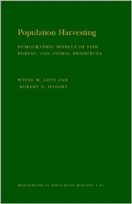
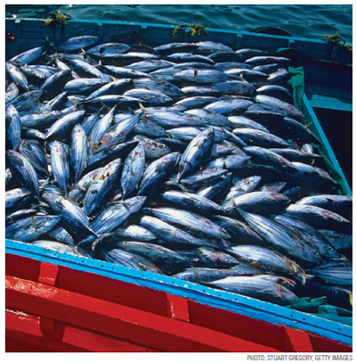

# Background {visibility="hidden"}


## {content-align="center" style="font-size: 160%;" background-image="figs/tuna.jpg" background-opacity=0.2}

<br>

<center>
Harvest Models
    
<!--  -->
<!--  -->

<br>

::: {style="font-size: 70%;"}
Applied Population Dynamics<br>
WILD 5700/7700
:::

</center>


## Learning objectives
  
Sustainable harvest and geometric growth.

<br>

Sustainable harvest and logistic growth.
  
<br>

Definition of maximum sustainable yield (MSY).
  
<br>

Limitations of MSY.
  
<br>

Additive vs compensatory mortality.


## Sustainable harvest
  
<br>

A sustainable (and large) harvest is a common objective in game management. 

<br>
  
::: {.fragment}
**Sustainable harvest**: A harvest that is balanced by population growth such that $N_{t+1} = N_t$.
:::


# Geometric growth and harvest {visibility="hidden"}


## Harvest and geometric growth

::: {.r-stack}
::: {.fragment .fade-out fragment-index=1}
$$
  N_{t+1} = N_t + N_t r
$$
:::

::: {.fragment .fade-in fragment-index=1}
$$
  N_{t+1} = N_t + N_t r - \color{red}{H_t}
$$
:::
:::

::: {style="font-size: 90%;"}


::: {.fragment}
where $\color{red}{H_t}$ is the number of animals harvested at the end of year $t$.
:::

<br>

::: {.fragment}
What value of $H_t$ achieves equilibrium (i.e., $N_{t+1} = N_t$)?
:::

:::


## Sustainable harvest and geometric growth
  
A sustainable harvest in this context is:
$$
  H_t = N_t r
$$

<br>
  
::: {.fragment}
Consequently, the sustainbale harvest rate ($h$) is:<br>

$$
  \begin{align*}
    h &= \frac{H_t}{N_t} \\
    h &= r \\
  \end{align*}
$$
:::


# Harvest and logistic growth {visibility="hidden"}


## Harvest and logistic growth

$$
N_{t+1} = N_t + N_t r_{max}\left(1 - \frac{N_t}{K} \right) - \color{red}{H_t}
$$

<br>

<center>
What value of $\color{red}{H_t}$ achieves equilibrium?
</center>


## Sustainable harvest and logistic growth


$$
    H_t = N_t r_{max}\left(1 - \frac{N_t}{K} \right)
$$
  
<br>

::: {.fragment style="font-size: 85%;"}

In this case, the sustainable harvest rate ($h$) depends on population size:
  
$$
  \begin{align*}
    h_t &= \frac{H_t}{N_t} \\
    h_t &= r_{max}\left(1 - \frac{N_t}{K} \right) \\
  \end{align*}
$$

:::

## Example when *K*=1000 and *r*~max~=0.1

$$
    H_t = N_t r_{max}\left(1 - \frac{N_t}{K} \right)
$$

```{r}
#| label: msy1
#| include: true
#| fig-align: center
#| fig-height: 5
N <- seq(0, 1000, by=10)
rmax <- 0.1
K <- 1000
H.1 <- N*rmax*(1 - N/K)
#par(mfrow=c(1,2), mai=c(0.7, 0.7, 0.2, 0.2))
#plot(0:T, Nl, xlab="Time", ylab="Population size (N)")
plot(N, H.1, type="l", #asp=1,
     col="black", lwd=2,
     cex.lab=1.4,
     xlab="Population size (N)",
     ylab="Sustainable harvest (H)")
abline(h=0, col=gray(0.7))
segments(K/2, 0, K/2, max(H.1), lty=2, lwd=2, col="purple")
```

<!-- <center> -->
<!--    -->
<!-- </center> -->


## Example when *K*=1000 and *r*~max~=0.5

$$
    H_t = N_t r_{max}\left(1 - \frac{N_t}{K} \right)
$$

  
```{r}
#| label: msy2
#| include: true
#| fig-align: center
#| fig-height: 5
N <- seq(0, 1000, by=10)
rmax <- 0.5
K <- 1000
H <- N*rmax*(1 - N/K)
plot(N, H, type="l", #asp=1,
     col="black", lwd=2,
     cex.lab=1.4,
     xlab="Population size (N)",
     ylab="Sustainable harvest (H)")
abline(h=0, col=gray(0.7))
segments(K/2, 0, K/2, max(H), lty=2, lwd=2, col="purple")
```

<!-- <center> -->
<!-- %   -->
<!--    -->
<!-- </center> -->


## Maximum sustainable yield
  
- MSY is found when $N=K/2$

- The maximum yield is $H = r_{max}K/4$

- The optimal harvest rate is $h = r_{max}/2$
  


## Is MSY useful in practice?

<center>
 {width="50%"}
</center>


## Issues

::: {style="font-size: 90%;"}

Larkin, P.A. 1977. An epitaph for the concept of maximum sustained yield. Transactions of the American Fisheries Society 106: 1-11.
  

::: {.fragment}
- Same assumptions as logistic growth model
  * K is constant
  * No age/sex/individual variation
  * No stochasticity
:::

::: {.fragment}
- Ecosystem impacts of reducing a population to half its carrying capacity? 
:::

::: {.fragment}
- Evolutionary consequences?
:::

:::

# Compensatory mortality {visibility="hidden"}


## Additive vs. compensatory mortality

::: {style="font-size: 85%;"}


::: incremental
- One possible mechanism giving rise to logistic growth is density-dependence in survival.
- For example, if population size is reduced, survival of the remaining individuals might increase.
- If harvest is compensated for by improved survival, harvest is a form of **compensatory mortality**.
- However, if harvest is not compensated for by improved survival, harvest is a form of **additive mortality**.
::: 

<br>

::: {.fragment style="color: RoyalBlue;"}
<center>
If harvest mortality is additive, extra caution is needed to ensure that harvest doesn't cause long-term population declines.
</center>
:::

:::


## Compensatory mortality example
  
::: {style="font-size: 85%;"}

Suppose a population of 100 white-tailed deer is subjected to harvest.

<br>

Harvest takes place prior to any natural mortality.

<br>

Natural mortality occurs in a density dependent fashion, such that survival probability ($S$) declines as $N$ increases.

<br>

::: {.fragment}
Let's assume: $$S = 0.8 - 0.005 \times N$$
:::

:::


## Individual survival vs. population size

$$S = 0.8 - 0.005 \times N$$

```{r}
#| label: phi1
#| include: true
#| fig-width: 8
#| fig-height: 7
#| fig-align: center
plot(function(x) 0.8 - 0.005*x, 0, 100, col="blue",
     xlab="Population size (N)",
     ylab="Survival (S)",
     ylim=c(0, 1), lwd=2, cex.lab=1.3)
```


<!--  -->


## S = 0.8 - 0.005 x N

Suppose 20 individuals are harvested from an initial population of 100 individuals.

How many individuals will remain at the end of the year?

How many would have remained at the end of the year if no hunting had occurred?
  
<center>
  
</center>


## Overall survival vs. harvest rate

The overall survival rate ($\bar{S}$) is product of survival throughout the hunting season ($1-h$) and survial after the hunting season.
  
$$
  \bar{S} = (1-h)(\beta_0 - \beta_1 (N - Nh))
$$


## Overall survival vs. harvest rate
  
```{r, phibar,include=FALSE,echo=FALSE,fig.height=6,fig.width=8}
plot(function(h) (1-h)*(0.8 - 0.005*(100 - 100*h)), 0, 1,
     ylim=c(0,0.5), xlab="Harvest rate (h)",
     ylab="Overall survival rate",
     main=expression(paste(beta[], "= 0.8, ", beta[], "= 0.005, N=100")),
     lwd=3, col="blue")
```
```{r, phibar2,include=FALSE,echo=FALSE,fig.height=6,fig.width=8}
plot(function(h) (1-h)*(0.8 - 0.005*(100 - 100*h)), 0, 1,
     ylim=c(0,0.5), xlab="Harvest rate (h)",
     ylab="Overall survival rate",
     main="", ##expression(paste(beta[], "= 0.8, ", beta[], "= 0, N=100")),
     lwd=3, col="blue")
plot(function(h) (1-h)*(0.3), 0, 1,,
     lwd=3, col="seagreen", add=TRUE)
legend(0.7, 0.5, c("Additive", "Compensatory"), lwd=3, col=c("seagreen", "blue"))
```
<center>
  \only<1|handout:0>{ \\}
  \only<2>{ \\}
</center>


## Density-dependent survival example

Mule deer fawn survival (From Bartman et al. 1992)


## Summary

Key points
  
- If growth is geometric, sustainable harvest occurs when $h=r$.
- If growth is logisitic, maximum sustainable yield occurs at $N=K/2$.
- If survival is density-dependent, harvest mortality can be compensated for by increased survival of remaining individuals (up to a point).
- If mortality is additive, extra caution is needed because harvest is adding to natural mortality without any compensation.
- Managers need to know if harvest mortality is additive or compensatory when setting harvest regulations.
  


## Assignment

Read pages 22--25 in Conroy and Carroll


