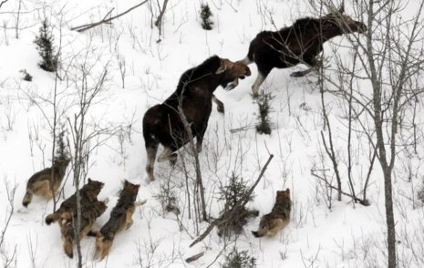
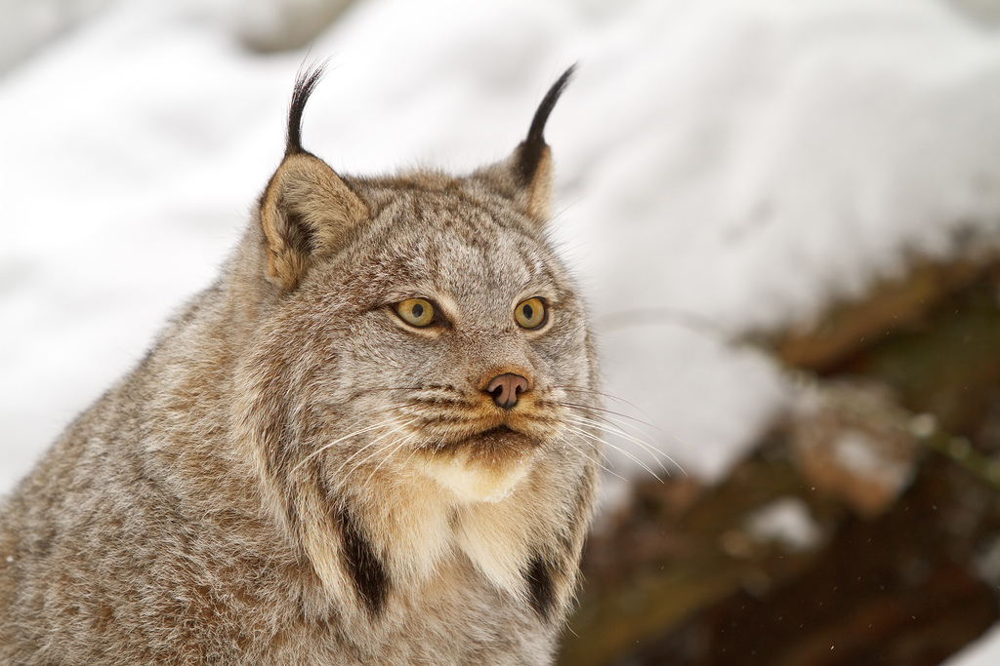
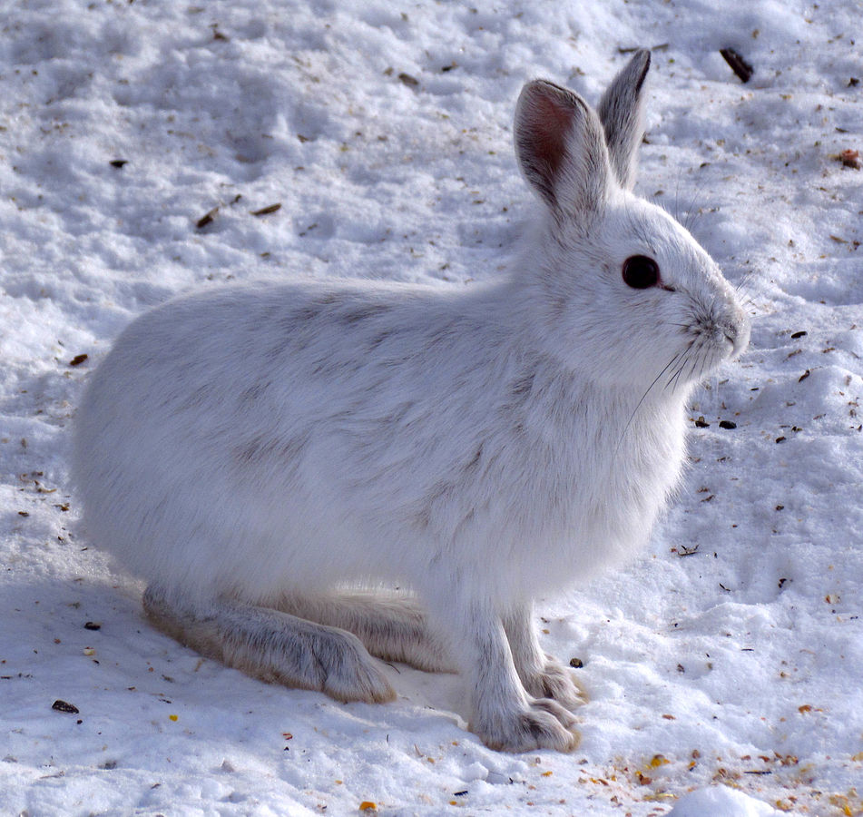
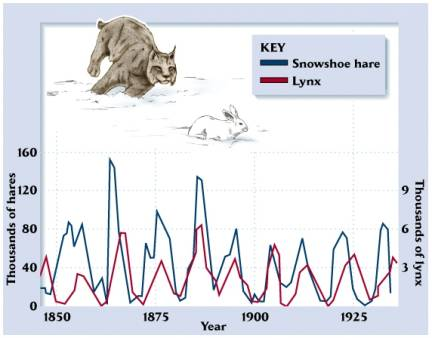
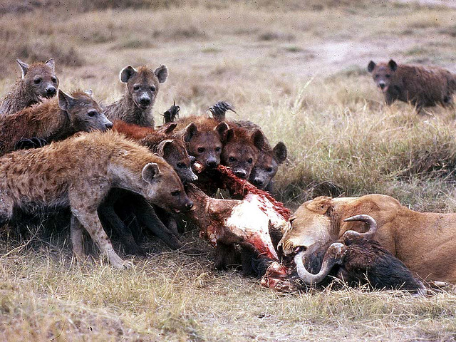
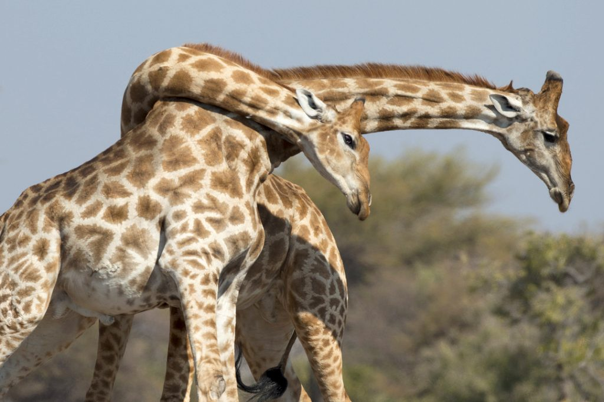

# Introduction {visibility="hidden"}

## {content-align="center" style="font-size: 160%;"}


<center>

**Models of interspecific interactions**

::: {style='font-size: 80%;'}

Predator-prey dynamics and competition

:::


{height="3.8in"}

</center>


## Introduction
  
::: {style='font-size: 90%;'}
Lotka and Volterra developed models for both predator-prey dynamics and competitive interactions.

<br>

As usual, these models were developed as continuous-time models.
       
<br>

We will focus on discrete-time versions ($t = 1, 2, \ldots$).
       
<br>

We will ignore potential extensions with stochasticity, age structure, spatial structure, etc...
:::


# Predator-Prey dynamics


## [How should predator-prey dynamics operate?]{style="font-size: 80%;"}

<br>

::: {.fragment}
{height="400"}
{height="400"}
:::


## Lynx-hare cycles

<center>
[{width="70%"}](http://www.youtube.com/watch?v=t43Li0dLkvw)
</center>


## Lotka-Volterra predator-prey model
  
::: {style='font-size: 80%;'}

Model for prey
$$
  N^{prey}_{t+1} = N^{prey}_t + N^{prey}_t (r^{prey} - k^{pred} N^{pred}_t)
$$
  
  
Model for predator
$$
  N^{pred}_{t+1} = N^{pred}_t + N^{pred}_t (b^{pred}N^{prey}_t - d^{pred})
$$
  
  
- Model is based on geometric growth
- $r^{prey}$: growth rate of the prey in the absence of predators
- $k^{pred}$: kill rate
- $b^{pred}$: effect of prey on predator birth rate
- $d^{pred}$: predator mortality rate
  
:::


## Equilibrium
  
Equilibrium for prey occurs when:
$$
  N^{pred} = \frac{r^{prey}}{k^{pred}}
$$
  
::: {.fragment}
Equilibrium for predators occurs when\dots
$$
  N^{prey} = \frac{d^{pred}}{b^{pred}}
$$
:::
  
::: {.fragment}
However, it is rare that both equilibrium conditions will be met at
the same time, and so the populations will cycle.
:::


## Model predicts population cycles

```{r}
#| label: predprey1
#| include: true
#| echo: false
#| fig-width: 8
#| fig-height: 6
#| fig-align: center
T <- 75
Nprey <- integer(T+1)
Npred <- integer(T+1)
Nprey[1] <- 101
Npred[1] <- 22
rprey <- 0.2
dprey <- 0.01
bpred <- 0.005
dpred <- 0.5
for(t in 1:T) {
    Nprey[t+1] <- Nprey[t] + Nprey[t]*(rprey - dprey*Npred[t])
    Npred[t+1] <- Npred[t] + Npred[t]*(bpred*Nprey[t] - dpred)
}
plot(0:T, Nprey, xlab="Time", ylab="Population size", type="l", col="cyan4",
     pch=16, ylim=c(0, 250))
lines(0:T, Npred, type="l", col="red", pch=16)
legend(0, 250, c("Prey", "Predator"), lty=1, ##pch=16,
       col=c("cyan4", "red"))
```


## Isle Royale wolves and moose

<center>
[{width="90%"}](http://www.youtube.com/watch?v=PdwnfPurXcs)
<!-- %  Attack video: \url{ -->
<!-- %  https://youtu.be/Ju3er3xIl7E -->
<!-- % } -->

[Isle Royale Website](https://isleroyalewolf.org/)
</center>


## Haffaker's Lab Experiments

<br>

<center>
<iframe width="728" height="410" src="https://www.youtube-nocookie.com/embed/-b_VBIhbuwM?si=xOquYGAMwW4kmED7" title="YouTube video player" frameborder="0" allow="accelerometer; autoplay; clipboard-write; encrypted-media; gyroscope; picture-in-picture; web-share" referrerpolicy="strict-origin-when-cross-origin" allowfullscreen></iframe>
</center>


# Competition


## Competition

<center>

</center>

<!-- [David Bygott]{style="font-size: 50%; color: Gray; text-align: right;"} -->


## Lotka-Volterra competition model
  
Model for species A
$$
  N^A_{t+1} = N^A_t + r^A N^A_t(K^A - N^A_t - \alpha^B N^B_t) / K^A
$$
  
Model for species B
$$
  N^B_{t+1} = N^B_t + r^B N^B_t(K^B - N^B_t - \alpha^A N^A_t) / K^B
$$  
  

::: {style='font-size: 80%;'}
  
- Model based on logistic growth
- The $\alpha$ parameters are competition coefficients determining how strongly each species affects the other
  
:::


## Equilibrium
  
Equilibrium for species A
$$
  N^A = \frac{K^A - \alpha^B K^B}{1 - \alpha^A \alpha^B}
$$
  
  
Equilibrium for species B
$$
  N^B = \frac{K^B - \alpha^A K^A}{1 - \alpha^A \alpha^B}
$$


## Outcomes

<br>
  
Three posssible outcomes:

1. Stable coexistence
2. Competitive exclusion
3. Unstable equilibrium
  
::: {.fragment}
**Competitive exclusion principle**
Two species with the same niche cannot coexist on the same limiting resource.
:::


## Outcomes

  
```{r}
#| label: compex
#| fig-height: 7
#| fig-width: 7
#| out-width: "40%"
#| include: false
## #| output-location: "column"
T <- 75
N.A <- integer(T+1)
N.B <- integer(T+1)
N.A[1] <- 100
N.B[1] <- 50
r.A <- 0.2
r.B <- 0.1
K.A <- 150
K.B <- 90
alpha.A <- 0.4
alpha.B <- 0.2
for(t in 1:T) {
    N.A[t+1] <- N.A[t] + r.A*N.A[t]*(K.A - N.A[t] - alpha.B*N.B[t])/K.A
    N.B[t+1] <- N.B[t] + r.B*N.B[t]*(K.B - N.B[t] - alpha.A*N.A[t])/K.B
}
plot(0:T, N.A, xlab="Time", ylab="Population size", type="b", col="cyan4",
     main="Competitive exclusion", cex.lab=1.5, cex.main=2,
     pch=16, ylim=c(0, 200))
lines(0:T, N.B, type="b", col="red", pch=16)
legend(0, 200, c("Species A", "Species B"), lty=1, pch=16, col=c("cyan4", "red"))

T <- 75
N.A <- integer(T+1)
N.B <- integer(T+1)
N.A[1] <- 100
N.B[1] <- 50
r.A <- 0.2
r.B <- 0.1
K.A <- 150
K.B <- 90
alpha.A <- 0.05
alpha.B <- 0.1
for(t in 1:T) {
    N.A[t+1] <- N.A[t] + r.A*N.A[t]*(K.A - N.A[t] - alpha.B*N.B[t])/K.A
    N.B[t+1] <- N.B[t] + r.B*N.B[t]*(K.B - N.B[t] - alpha.A*N.A[t])/K.B
}
plot(0:T, N.A, xlab="Time", ylab="Population size", type="l", col="cyan4",
     main="Stable coexistence", cex.lab=1.5, cex.main=2,
     pch=16, ylim=c(0, 200))
lines(0:T, N.B, type="l", col="red", pch=16)
legend(0, 200, c("Species A", "Species B"), lty=1, col=c("cyan4", "red"))
```
<br>

<center>
{height="500"}
{height="500"}
</center>


## [Don't forget about intraspecific competition]{style="font-size: 80%;"}

<center>
[{width="80%"}](https://youtu.be/KQLPL1qRhn8)
</center>


## Summary
  
::: {style='font-size: 80%;'}

Predator-prey model is extension of geometric growth
    
- Predators and prey limit each other's growth potential
    
::: {.fragment}
Competition model is extension of logistic growth
    
- Competitors influence each other's density-dependent regulation process
:::
    
::: {.fragment}
These models could be extended to include:

::: {.columns}

::: {.column width="40%"}
- More species
- Stochasticity
- Age structure
:::

::: {.column width="60%"}
- Harvest
- Spatial structure
- Additional forms of density dependence
:::

:::
:::


:::


