# Introduction {visibility="hidden"}

## Dynamic populations

{width="80%" fig-align="center" fig-alt="Wilson warbler migration dynamics"}

## Central Questions

1.  What causes spatial and temporal variation in population size and
    structure?

2.  How do environmental change and human activities (including
    management actions) affect populations?

## Learning objectives

**By the end of the semester, you should be able to:**

::: {.incremental}
1.  Develop a population model that:

    - Describes variation in demographic parameters over time

    - Predicts how a population will respond to management and
      conservation actions.

2.  Design a study to collect the data necessary to estimate the
    demographic parameters of the model.

3.  Use `R` software to estimate parameters from field data.
:::

## Themes

::: columns
::: {.column width="50%"}

### Theory

- Population models
:::

<!-- . . . -->

::: {.column width="50%"}
### Practice (Application)

- Study design

- Data collection

- Parameter estimation

- Population viability analysis

- Harvest management

- Small population management
:::

:::

# Examples {visibility="hidden"}

## Example I -- Louisiana black bear

::: columns
::: {.column width="50%"}
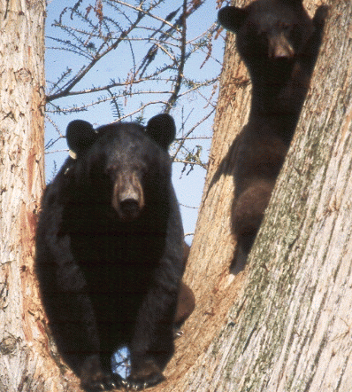
:::

::: {.column width="40%"}
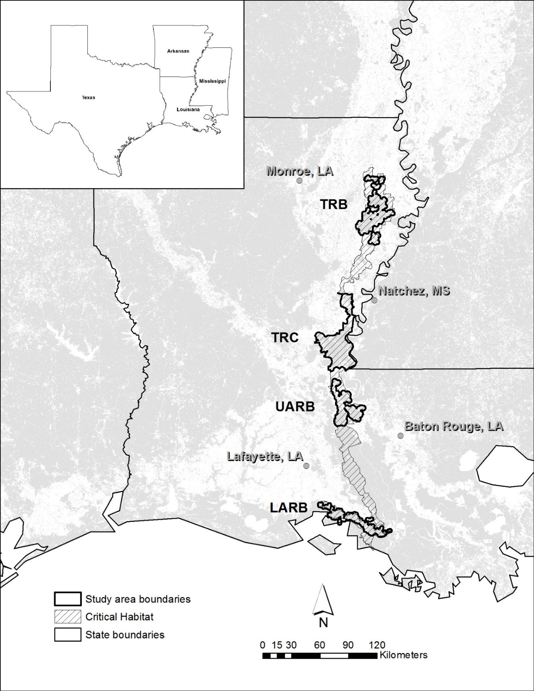
:::
:::

## Estimated demographic parameters

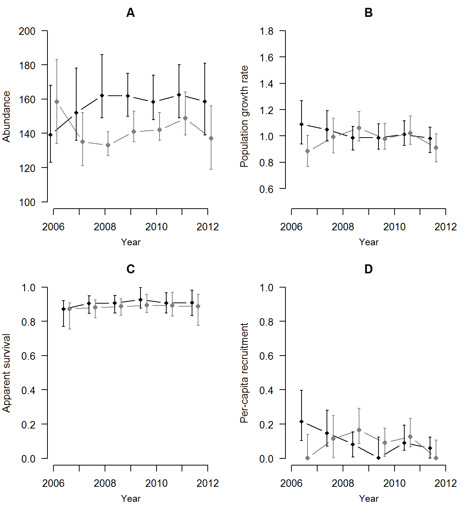{width="50%" fig-align="center"}

## Example II -- Black-throated blue warbler {style="font-size: 80%;"}

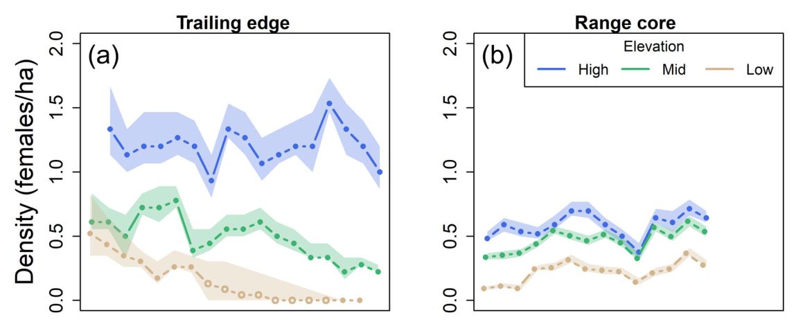{width="75%" fig-align="center"}

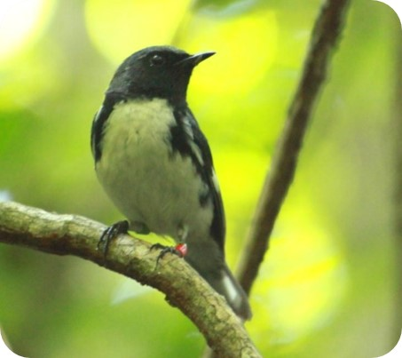{width="15%" fig-align="center"}

Why are dynamics so different in the southern part of the range?

## Example III -- Chiricahua Leopard Frog

::: columns
::: {.column width="50%"}

:::

::: {.column width="40%"}

:::
:::

## Recovery Plan

::: center
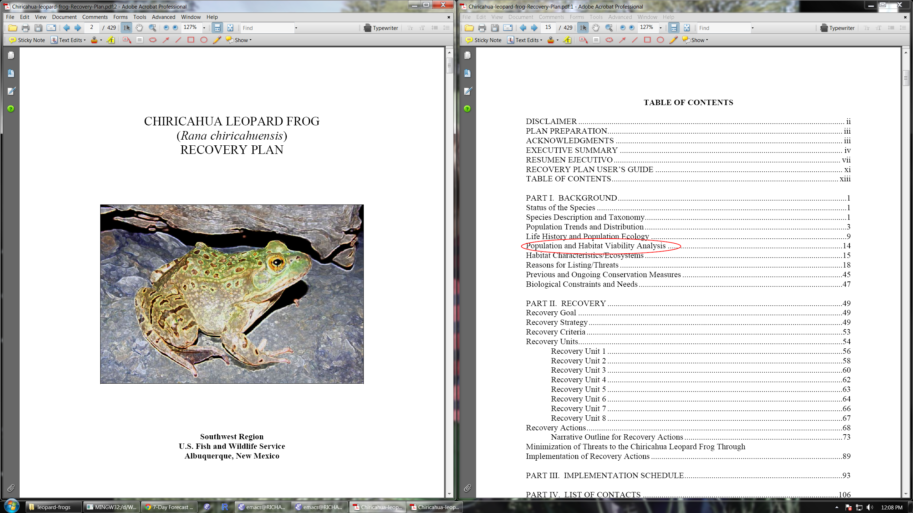
:::

## Estimated extinction risk {.smaller}

Management options

- Control predators

- Increase hydroperiod in existing wetlands

- Create new wetlands...

Extinction risk was predicted to be 4% after 50 years. Restoring just 1
pond, reduced the risk to 2.5%.

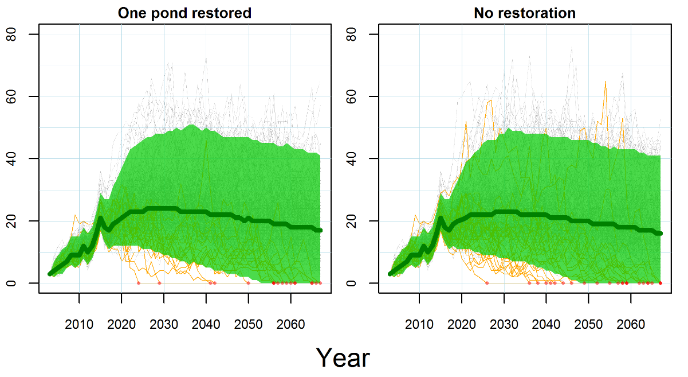{width="65%" fig-align="center"}

## Colonization Probability Maps

{width="50%" fig-align="center"}

## Example IV -- South Florida Deer Study {.smaller}

**Objectives**

1.  Understand effects of hydrology, hunting, and predation on deer
    population dynamics

2.  Develop a camera trapping study for large-scale investigation and
    monitoring of deer populations

::: columns

::: {.column width="50%"}
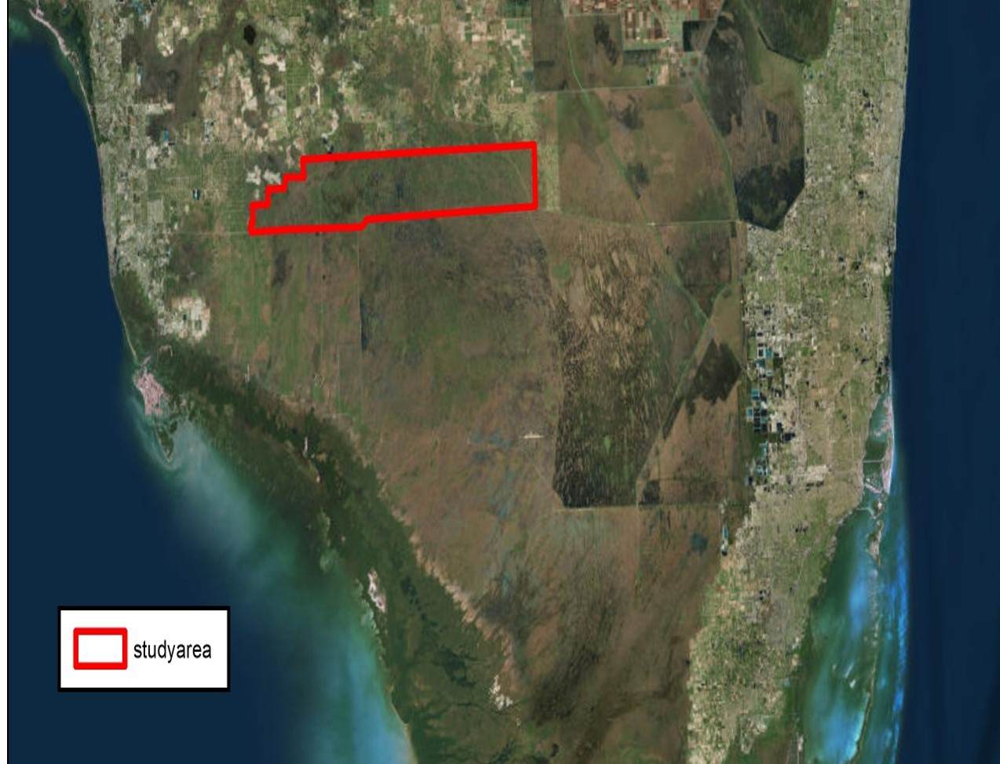{width="70%" fig-align="center"}
:::

::: {.column width="50%"}
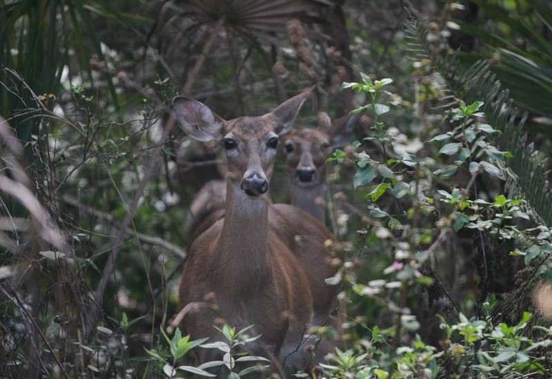{width="80%" fig-align="center"}
:::

:::

## Camera study {.smaller}

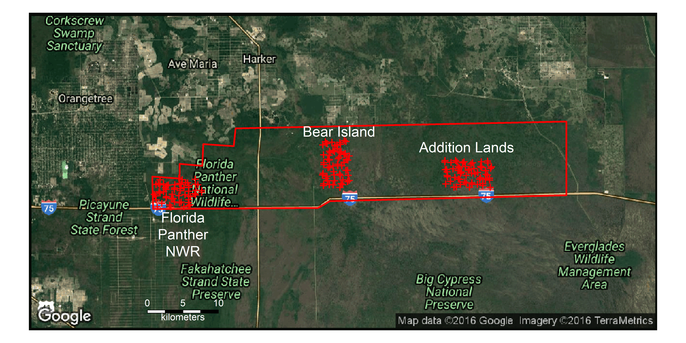{width="50%" fig-align="center"}

::: columns

::: {.column width="25%"}

:::

::: {.column width="75%"}
- 180 cameras
- Operated Jan 2015 -- Jan 2018
- Spanning hunting and hydrology gradients
:::

:::

## Telemetry data

250 deer collared 2015 -- 2018

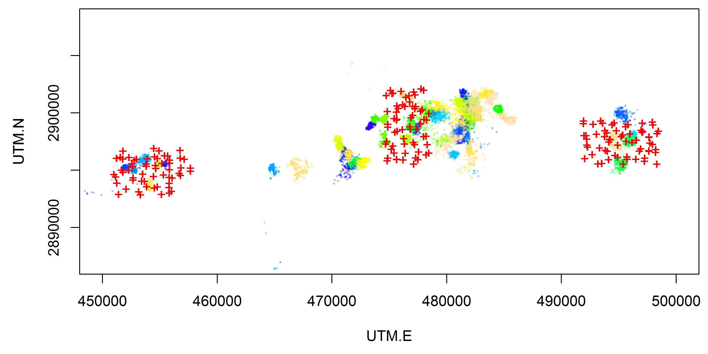

## Abundance over time

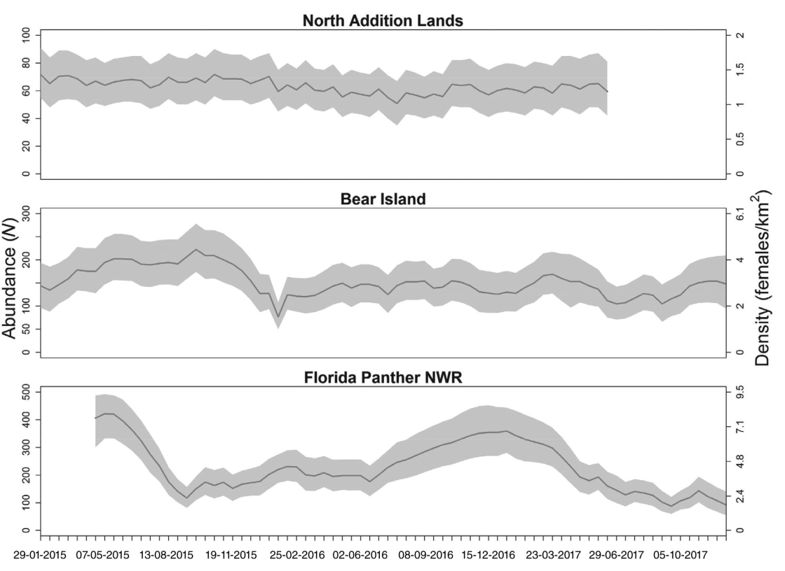{fig-align="center" width="90%"}

## Survival and predation rate

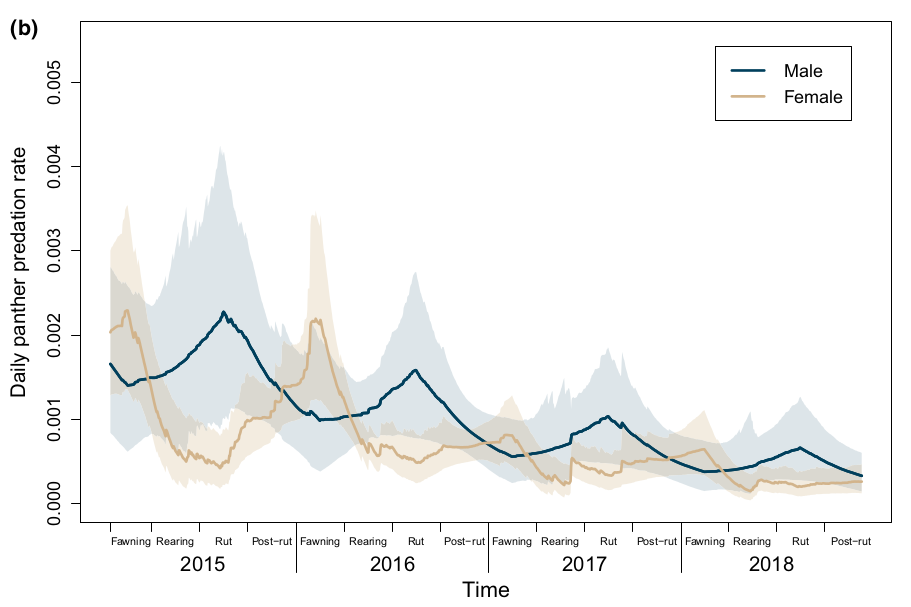{width="95%"}

# Syllabus {visibility="hidden"}

## Syllabus

<!-- ::: -->
<!-- {fig-align="center" width="50%"} -->
<!-- ::: -->

<!-- <iframe src="../../APD-syllabus.pdf" width="50%" height="550px"></iframe> -->

<!-- {fig-align="center" width="50%"} -->

<iframe src="../../APD-syllabus.pdf" width="50%" height="550px" style="display: block; margin: 0 auto;"></iframe> 

## Tips for success in this course

::: {.incremental}
- Take notes on printed handouts
- Don't bring laptops/tablets to lecture
- Review notes before each lecture
- Keep up with assigned readings
- Finish lab assignments during lab
- Ask questions during class
- Start the final project early
- Visit with me and the TAs during office hours
:::

# Assignment {visibility="hidden"}

## Assignment

::: columns
:::  {.column width="60%"}

::: {.non-incremental}
1.  Read Chapters 1 and 2 of Conroy and Carroll

2.  Complete the introductory "survey quiz" found [here](https://goo.gl/forms/OpmugP5lmMrrXTIY2).
:::
:::

::: {.column width="40%"}
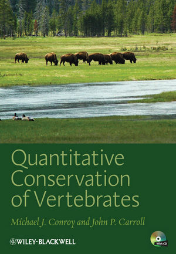
:::
:::

Survey: https://goo.gl/forms/OpmugP5lmMrrXTIY2