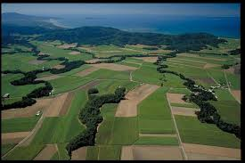
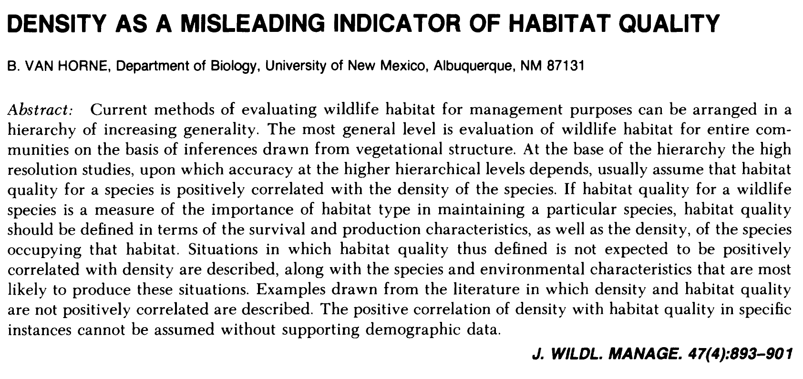
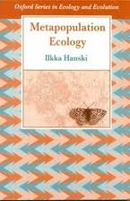
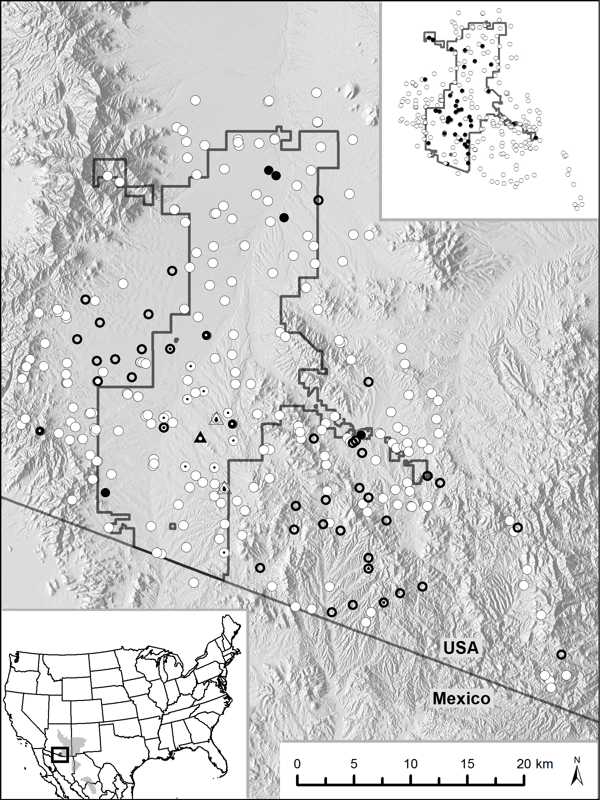
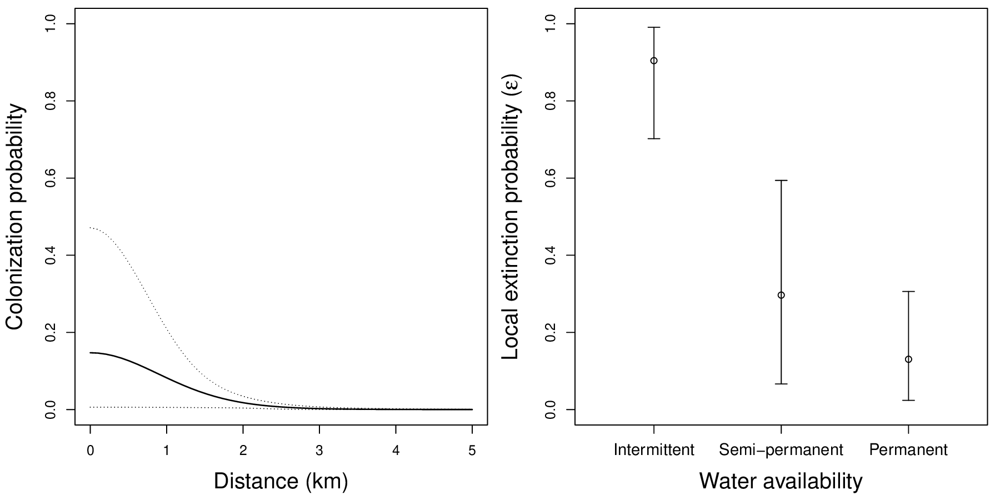
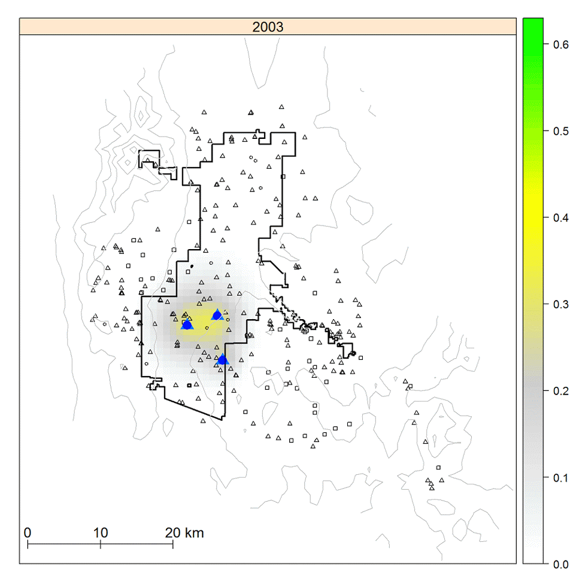
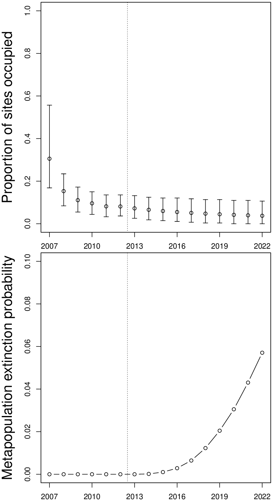

# Introduction {visibility="hidden"}

## {content-align="center" style="font-size: 160%;"}


<center>

**Metapopulation models**

<br>

{height=8cm}
{height=8cm}

::: {style='font-size: 50%;'}
Applied Population Dynamics (WILD 5700/7700)
:::

</center>


## Metapopulations
  
<br>

<center> 
::: {style='font-size: 110%;'}
A **metapopulation** is a population of subpopulations linked by dispersal.
:::
</center>
  
<br>


::: {style='font-size: 90%;'}
::: {.fragment}
**Properties**
  
- Subpopulations occur in discrete habitat patches.
- The landscape "matrix" is not suitable for reproduction.
:::
:::
  


## Motivation
  
::: {style='font-size: 80%;'}

::: {.columns}
::: {.column width='55%'}

- Many populations are fragmented.

<br>

::: {.fragment}
- Metapopulation models can be used to forecast dynamics of fragmented populations.
:::

<br>

::: {.fragment}
- Models can be used to identify critical habitat patches or locations for establishing new subpopulations.
:::

:::

::: {.column width='45%'}
{width=8cm}

<br>

{width=8cm}
:::
:::

:::


## Origins

::: {.columns}
::: {.column width='35%'}
Richard Levins <br>
{height="7cm"}
:::
::: {.column width='65%'}
::: {style='font-size: 90%;'}
First metapopulation models were parameterized in terms of the **proportion of patches occupied**.

<br>
<br>

::: {.fragment}
Modern models are formulated in terms of patch-specific **site occupancy** or **abundance**.
:::
:::

:::
:::


# Abundance models


## Abundance formulation
  
::: {style='font-size: 80%;'}
A simple case with only three subpopulations

$$
    N_t = n_{1,t} + n_{2,t} + n_{3,t}
$$


```{mermaid}
%%| label: "metapop-diagram"
%%| fig-align: "center"
%%| fig-width: 7
%%| fig-height: 7
%%| out-width: '100%'
%%| eval: false
%%| include: false
---
config:
  flowchart:
    nodeSpacing: 50
    rankSpacing: 50
    padding: 15
  theme: forest
  layout: elk
  elk:
    nodePlacementStrategy: LINEAR_SEGMENTS
    nodePlacementAlignment: NONE
---
flowchart LR
  n1(("$$n_{1,t}$$")) --> n2(("$$n_{2,t}$$")) --> n3(("$$n_{3,t}$$"))
  n1 --> n3
  n2 --> n1
  n3 --> n2
  n3 --> n1
```

<center>

{width='40%'}

The movement probabilities ($\pi_{i,j}$) indicate the proportion of individuals moving from patch $i$ to patch $j$. 

</center>

:::


## Abundance models

::: {style='font-size: 90%;'}
Building the metapopulation model for the first subpopulation.
  
::: {.r-stack}

::: {.fragment .fade-out fragment-index=1}
$$
  n_{1,t+1} = n_{1,t}\lambda_1 \phantom{\color{blue}{(1 - \pi_{1,2} - \pi_{1,3})} + {\color{red}{n_{2,t}\lambda_2 (\pi_{2,1}) + n_{3,t}\lambda_3 (\pi_{3,1})}}}
$$
:::
::: {.fragment .fade-in-then-out fragment-index=1}
$$
  n_{1,t+1} = n_{1,t}\lambda_1 \color{blue}{(1 - \pi_{1,2} - \pi_{1,3})} \phantom{+ {\color{red}{n_{2,t}\lambda_2 (\pi_{2,1}) + n_{3,t}\lambda_3 (\pi_{3,1})}}} 
$$
:::
::: {.fragment .fade-in-then-out fragment-index=2}
$$
  n_{1,t+1} = n_{1,t}\lambda_1 \color{blue}{(1 - \pi_{1,2} - \pi_{1,3})} + {\color{red}{n_{2,t}\lambda_2 (\pi_{2,1}) + n_{3,t}\lambda_3 (\pi_{3,1})}}
$$
:::
 
:::
:::

  
Three components:

1.  Geometric growth

::: {.fragment .fade-in fragment-index=1}
2.  [1 minus emigration rates, Pr(not emigrating)]{style="color: blue;"}
:::
::: {.fragment .fade-in fragment-index=2}
3.  [Immigration from subpopulations 2 and 3]{style="color: red;"}
:::
  


## What influences movement?

<br>

::: {style='font-size: 90%;'}
Movement probabilities ($\pi_{i,j}$) can be influenced by many factors:
  
::: {.incremental}

- Habitat quality in the patch of origin
- Habitat quality in the landscape between origin and destination patches
- Habitat quality in the destination patch
- Distance between patches
  
:::
:::


## Sources, sinks, and traps

::: {style='font-size: 80%;'}
**Source**

A patch with $\lambda>1$ in the absence of immigration. Sources tend to be net exporters of individuals.

<br>

::: {.fragment}
**Sink**

A patch with $\lambda<1$ in the absence of immigration. Sinks would go extinct in the absence of immigration.
:::
  
<br>

::: {.fragment}
**Ecological trap**

A sink that animals incorrectly perceive as a high quality source.
:::
:::


## Density and habitat quality

::: {style='font-size: 80%;'}
Can we identify sources, sinks, and traps by estimating patch-specific density (at one point in time)?
:::

<center>
{width='80%'}
</center>

::: {.fragment}
**Assignment**: Read this paper and be prepared to discuss it.
:::


# Occupancy models


## Occupancy models

<br>

::: {style='font-size: 90%;'}
**Emphasis on stochastic patch-level dynamics**

::: {.incremental}
- What is the probability that a patch will be occupied?
- What is the probability that an empty patch will be colonized?
- What is the probability that a subpopulation will go locally extinct?
- What is the probability that the entire metapopulation will go extinct?
:::

:::

  


## Definitions

::: {style='font-size: 77%;'}
**Occurrence** ($O_{i,t}$): Indicates if patch $i$ occupied at time $t$

<br>
  
::: {.fragment}
**Occurrence probability** (psi=$\psi_{i,t}$): Probability that site $i$ is occupied at time $t$
:::

<br>

::: {.fragment}
**Colonization probability** (gamma=$\gamma$): Probability that an unoccupied patch at time $t$ becomes occupied at time $t+1$.
:::
  
<br>
  
::: {.fragment}
**Local extinction probability** (epsilon=$\varepsilon$): Probability that an occupied patch at time $t$ becomes unoccupied at time $t+1$.
:::
  
<br>
  
::: {.fragment}
**Metapopulation extinction risk**: Probability that all subpopulation will go extinct.
:::
:::


## Example


```{r}
#| label: metapop1
#| include: true
#| echo: false
#| results: 'hide'
#| fig-width: 9
#| fig-heigth: 7
#| out-width: '100%'
set.seed(1)#(388730)
N <- 10
T <- 5
X <- cbind(runif(N, 1, 9), runif(N, 1, 9))
psi <- 0.4
z1 <- z2 <- z3 <- matrix(0L, N, T)
z1[,1] <- z2[,1] <- z3[,1] <- rbinom(N, 1, psi)
for(t in 2:T) {
    z1[,t] <- z1[,t-1]
    z2[,t] <- rbinom(N, 1, z2[,t-1]*1 + (1-z2[,t-1])*0.8)
    z3[,t] <- rbinom(N, 1, z3[,t-1]*.2 + (1-z3[,t-1])*0.8)
}
par(mai=c(0.02,0.02,0.02,0.02), mfrow=c(4, 6))
plot(0, 0, type="n", ann=FALSE, axes=FALSE)
plot(0, 0, type="n", ann=FALSE, axes=FALSE)
text(0, -0.8, "Year 1", cex=2)
plot(0, 0, type="n", ann=FALSE, axes=FALSE)
text(0, -0.8, "Year 2", cex=2)
plot(0, 0, type="n", ann=FALSE, axes=FALSE)
text(0, -0.8, "Year 3", cex=2)
plot(0, 0, type="n", ann=FALSE, axes=FALSE)
text(0, -0.8, "Year 4", cex=2)
plot(0, 0, type="n", ann=FALSE, axes=FALSE)
text(0, -0.8, "Year 5", cex=2)
plot(0, 0, type="n", ann=FALSE, axes=FALSE)
text(0, 0, "Low extinction\nLow colonization", cex=1.5)
symbols(X, circles=rep(0.5,nrow(X)), bg=ifelse(z1[,1]==TRUE, "cyan", "white"),
        xlim=c(0, 10), ylim=c(0, 10), inches=FALSE, xaxt="n", yaxt="n", ann=FALSE)
symbols(X, circles=rep(0.5,nrow(X)), bg=ifelse(z1[,1]==TRUE, "cyan", "white"),
        xlim=c(0, 10), ylim=c(0, 10), inches=FALSE, xaxt="n", yaxt="n", ann=FALSE)
symbols(X, circles=rep(0.5,nrow(X)), bg=ifelse(z1[,1]==TRUE, "cyan", "white"),
        xlim=c(0, 10), ylim=c(0, 10), inches=FALSE, xaxt="n", yaxt="n", ann=FALSE)
symbols(X, circles=rep(0.5,nrow(X)), bg=ifelse(z1[,1]==TRUE, "cyan", "white"),
        xlim=c(0, 10), ylim=c(0, 10), inches=FALSE, xaxt="n", yaxt="n", ann=FALSE)
symbols(X, circles=rep(0.5,nrow(X)), bg=ifelse(z1[,1]==TRUE, "cyan", "white"),
        xlim=c(0, 10), ylim=c(0, 10), inches=FALSE, xaxt="n", yaxt="n", ann=FALSE)
plot(0, 0, type="n", ann=FALSE, axes=FALSE)
text(0, 0, "Low extinction\nHigh colonization", cex=1.5)
symbols(X, circles=rep(0.5,nrow(X)), bg=ifelse(z2[,1]==TRUE, "cyan", "white"),
        xlim=c(0, 10), ylim=c(0, 10), inches=FALSE, xaxt="n", yaxt="n", ann=FALSE)
symbols(X, circles=rep(0.5,nrow(X)), bg=ifelse(z2[,2]==TRUE, "cyan", "white"),
        xlim=c(0, 10), ylim=c(0, 10), inches=FALSE, xaxt="n", yaxt="n", ann=FALSE)
symbols(X, circles=rep(0.5,nrow(X)), bg=ifelse(z2[,3]==TRUE, "cyan", "white"),
        xlim=c(0, 10), ylim=c(0, 10), inches=FALSE, xaxt="n", yaxt="n", ann=FALSE)
symbols(X, circles=rep(0.5,nrow(X)), bg=ifelse(z2[,4]==TRUE, "cyan", "white"),
        xlim=c(0, 10), ylim=c(0, 10), inches=FALSE, xaxt="n", yaxt="n", ann=FALSE)
symbols(X, circles=rep(0.5,nrow(X)), bg=ifelse(z2[,5]==TRUE, "cyan", "white"),
        xlim=c(0, 10), ylim=c(0, 10), inches=FALSE, xaxt="n", yaxt="n", ann=FALSE)
plot(0, 0, type="n", ann=FALSE, axes=FALSE)
text(0, 0, "High extinction\nHigh colonization", cex=1.5)
symbols(X, circles=rep(0.5,nrow(X)), bg=ifelse(z3[,1]==TRUE, "cyan", "white"),
        xlim=c(0, 10), ylim=c(0, 10), inches=FALSE, xaxt="n", yaxt="n", ann=FALSE)
symbols(X, circles=rep(0.5,nrow(X)), bg=ifelse(z3[,2]==TRUE, "cyan", "white"),
        xlim=c(0, 10), ylim=c(0, 10), inches=FALSE, xaxt="n", yaxt="n", ann=FALSE)
symbols(X, circles=rep(0.5,nrow(X)), bg=ifelse(z3[,3]==TRUE, "cyan", "white"),
        xlim=c(0, 10), ylim=c(0, 10), inches=FALSE, xaxt="n", yaxt="n", ann=FALSE)
symbols(X, circles=rep(0.5,nrow(X)), bg=ifelse(z3[,4]==TRUE, "cyan", "white"),
        xlim=c(0, 10), ylim=c(0, 10), inches=FALSE, xaxt="n", yaxt="n", ann=FALSE)
symbols(X, circles=rep(0.5,nrow(X)), bg=ifelse(z3[,5]==TRUE, "cyan", "white"),
        xlim=c(0, 10), ylim=c(0, 10), inches=FALSE, xaxt="n", yaxt="n", ann=FALSE)
```


## Example


```{r}
#| label: ex2
#| include: true
#| echo: false
#| results: 'hide'
#| fig-height: 7
#| fig-width: 8
#| fig-align: 'center'
#| out-width: '95%'
par(mfrow=c(3,2), mai=c(0.7,0.8,0.4,0.1))
plot(0, 0, type="n", ann=FALSE, axes=FALSE,)
text(0, 0, "Low extinction\nLow colonization", cex=2.4)
plot(1:5, colSums(z1)/N, type="b", xlab="Year",
     ylab="Proportion of\nsites occupied", ylim=0:1, cex.lab=1.8)
plot(0, 0, type="n", ann=FALSE, axes=FALSE)
text(0, 0, "Low extinction\nHigh colonization", cex=2.4)
plot(1:5, colSums(z2)/N, type="b", xlab="Year",
     ylab="Proportion of\nsites occupied", ylim=0:1, cex.lab=1.8)
plot(0, 0, type="n", ann=FALSE, axes=FALSE)
text(0, 0, "High extinction\nHigh colonization", cex=2.4)
plot(1:5, colSums(z3)/N, type="b", xlab="Year",
     ylab="Proportion of\nsites occupied", ylim=0:1, cex.lab=1.8)
```


## The model

$$
    \psi_{i,t+1} = O_{i,t}(1-\varepsilon) + (1-O_{i,t})\gamma \\
    O_{i,t+1} \sim \mbox{Bernoulli}(\psi_{i,t+1})
$$

  
::: {style='font-size: 80%;'}
- $O_{i,t}$=1 if patch $i$ is occupied at time $t$ <br>
- $O_{i,t}$=0 if patch $i$ is unoccupied at time $t$ <br>
- $\psi_{i,t}$ is probability that patch $i$ will be occupied at time $t$ <br>
- $\varepsilon$ is local extinction probability <br>
- $\gamma$ is colonization probability
:::


## [Assumptions of basic non-spatial model]{style="font-size: 90%;"}
  
::: {.incremental}

- Abundance doesn't matter
- Patch quality is constant
- Colonization and local extinction probabilities are constant
- Landscape matrix doesn't matter
  
:::


## Spatial models

<center>
{height=13cm}
{height=13cm}
</center>


## Spatial models
  
All else equal...

::: {style='font-size: 80%;'}
- An unoccupied site should have a higher chance of being colonized if it is close to an occupied site than if it is isolated. 

::: {.fragment}
- Similarly, isolated sites should have a higher extinction probability than connected sites (rescue effect).
:::

::: {.fragment}
- Connectivity is determined by:
  * Dispersal ability
  * Spatial configuration of sites
  * Landscape resistance to movement
:::
:::
      


# Case study


## 

::: {.columns}
::: {.column width='45%'}

:::
::: {.column width='10%'}
:::
::: {.column width='45%'}
 <br>

:::
:::


## Results




## Results

{width="50%" fig-align="center"}


## Results

<center>
{height=15cm}
</center>


## Summary

<br>

Metapopulation models are widely used to describe the dynamics of fragmented populations.

<br>
  
Model can be formulated in terms of patch-level abundance or occupancy.
  
<br>

Modern models are stochastic and spatially explicit.


