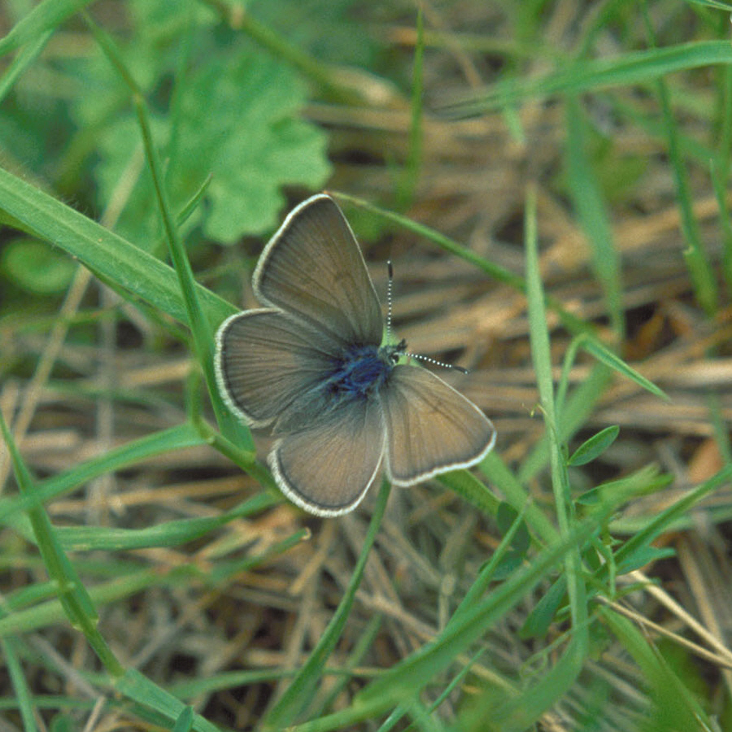
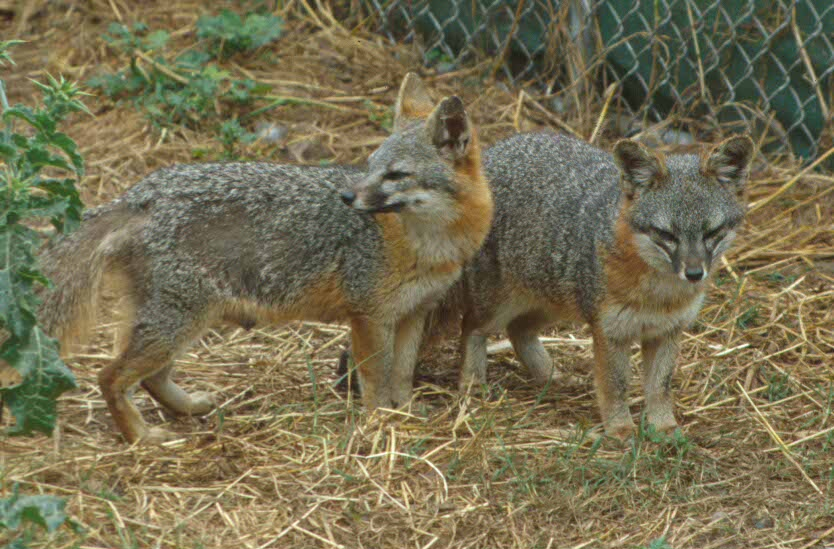

# Introduction {visibility="hidden"}

## {content-align="center" style="font-size: 160%;"}


<center>

**Population viability analysis <br> and sensitivity analysis**

{height=10cm}
{height=10cm}

</center>


## What is PVA?
  
<br>

**Population Viability Analysis**
  
> "The use of quantitative methods to predict the likely future status of a population or collection of populations of conservation concern."

::: {style='font-size: 80%; text-align: right; color: grey;'}
Morris and Doak (2002)
:::


## History {background-image="figs/Grizzly_Denali.jpg"}

First used by Shaffer (1983) to estimate the **minimum viable population** size in Yellowstone National Park

<!-- <center> -->
<!--  -->
<!-- </center> -->

<br><br><br><br><br><br><br><br>
  
Now routine part of species assessments and recovery plans.


# Uses {visibility="hidden"}


## Uses of PVA

::: {.incremental style='font-size: 80%;'}
* Assessing the extinction risk of a single population
* Comparing relative risks of two or more populations
* Analyzing and synthesizing monitoring data
* Identifying key life stages or demographic processes as management targets (sensitivity analysis)
* Determining how large a reserve needs to be to achieve a desired level of protection from extinction
* Determining how many individuals to release to establish a new population
* Setting limits on the harvest or "take" from a population that are compatible with its continued existence
* Determining how many (and which) populations are needed to achieve a desired overall likelihood of species persistence
:::
  

## Steps of PVA

::: {.incremental style='font-size: 90%;'}
1. Develop objectives
2. Develop a set of competing models
3. Design a study to collect necessary data
4. Fit models to data and select the best model(s)
5. Use model(s) to identify best management options
6. Implement management option, monitor the consequences, and refine models
7. Return to step 4
:::


::: {.fragment}
<center>
**Very similar to adaptive management**
</center>
:::


## Types of PVA
  
::: {style='font-size: 75%;'}
- Count-based PVA
    * This is the cheapest, but least-informative method
      
::: {.fragment}
- Demographic PVA
    * Requires estimates of vital rates
    * Useful for identifying key demographic parameters
:::
      
::: {.fragment}
- Metapopulation viability analysis
    * Useful in reserve design
:::
      
::: {.fragment}
- Spatially-explicit, individual-based PVA
    * Most realistic, but hardest to parameterize
:::
      


::: {.fragment}
<center>
**All methods require clear definition of time horizon and acceptable level of extinction risk**
</center>
:::

:::


## Products of PVA

<br>

<center>
{width='65%'}
</center>


## Central Georgia black bears

::: {style='font-size: 70%;'}
Smallest and most isolated bear population in GA.
  
Little information about the effects of harvest on population viability.
  
Five years of genetic capture-recapture data were used to estimate abundance and develop population models.
:::
  
<center>
{height=9cm}
{height=9cm}
</center>
  
::: {style='font-size: 60%; text-align: right; color: grey;'}
Hooker et al. (2020, JWM)
:::


## Central Georgia black bears
  
<center>
{width='70%'}
</center>


## Central Georgia black bears

<center>
{width='50%'}

::: {.fragment}
{width='50%'}
:::

::: {.fragment}
{width='50%'}
:::

</center>


# Sensitivity Analysis


## Sensitivity analysis

::: {style='font-size: 75%;'}
A sensitivity analysis seeks to understand the degree to which $\lambda$ is sensitive to changes in a vital rate, while holding all other rates constant.
  
  
::: {.fragment}
Usually applied to age- or stage-based population models.
:::
  
  
::: {.fragment}
The sensitivity of $\lambda$ to a change in a population parameter $\theta$ (e.g., survival or fecundity), is (loosely):
<!-- $$ -->
<!--     \text{sensitivity}_{i,j} = \frac{\partial \lambda}{\partial \theta_{i,j}} -->
<!-- $$ -->
$$
    \text{sensitivity} = {\small \lim\limits_{\Delta \theta \to 0}}\; \frac{\Delta \lambda}{\Delta \theta}
$$
:::
  
  
::: {.fragment}
**Sensitivities allow us to make statements such as:**

> "Increasing subadult fecundity by a small amount increases $\lambda$ by 0.01, whereas increasing adult fecundity by the same amount increases $\lambda$ by 0.02. Therefore, population growth is more sensitive to changes in adult fecundity."
:::


:::


## Sensitivity example
  
::: {style='font-size: 80%;'}

  Parameter                                $\Delta \theta$   $\Delta \lambda$   Sensitivity
  --------------------------------------- ----------------- ------------------ -------------
  Fecundity of first age class ($f_1$)          0.05              0.010            0.20
  Fecundity of second age class ($f_2$)         0.05              0.003            0.06
  Survival of first age class ($s_1$)           0.05              0.040            0.80
  Survival of second age class ($s_2$)          0.05              0.030            0.60

:::


## Elasticity

::: {style='font-size: 80%;'}

A problem with sensitivities is that it is hard to compare values for parameters on different scales, such as survival and fecundity. For this reason, it can be better to report "elasticities" instead.
  
  
::: {.fragment}
**Elasticity**: the proportional change in $\lambda$ caused by proportional changes in vital rates.
:::

::: {.fragment}
Easier interpretation because:

- Standardized units
- Values sum to 1

:::
   
   
::: {.fragment}
**Examples**
  
* "A 1% increase in $f_1$ increases $\lambda$ by 0.01%."
* "A 1% increase in $s_1$ increases $\lambda$ by 0.05%."
:::

:::
  


## R code for sensitivity analysis

::: {style='font-size: 70%;'}
Suppose we have the following stage-structured projection matrix:

```{r}
#| label: A
#| echo: true
A <- matrix(c(
    0.2, 0.8, 1.0, 0.9,
    0.4, 0.0, 0.0, 0.0,
    0.0, 0.6, 0.0, 0.0,
    0.0, 0.0, 0.8, 0.5), nrow=4, byrow=TRUE)
```

<br>

::: {.fragment}
We can use eigenanalysis to compute $\lambda$, stable age
distribution, reproductive value, sensitivities, and elasticities.

```{r}
#| label: eigen
#| echo: true
eA <- eigen(A)
lam <- Re(eA$values[1])
lam                              ## Asymtotic growth rate

w <- Re(eA$vectors[,1])
w <- w/sum(w)                    ## Stable age distribution

v <- Re(eigen(t(A))$vectors[,1]) ## Reproductive value
```
:::

:::


## R code for sensitivity analysis

::: {style='font-size: 80%;'}
The sensitivities are given by $z_{ij}=\frac{v_i w_j}{{\bf v}{\bf w}}$
```{r}
#| label: sen
#| echo: true
z <- outer(v,w)/c(v%*%w)
z ## Sensitivites
```

<br>

::: {.fragment}
The elasticities are given by $e_{ij}=\frac{a_{ij}z_{ij}}{\lambda}$
```{r}
#| label: el
#| echo: true
e <- A*z/lam
e  ## Elasticities
```
:::

:::


# Summary {visibility="hidden"}


## Summary

::: {style='font-size: 80%;'}
PVA covers almost all methods for predicting how populations will respond to future scenarios.
  
The most common use is to assess how different conservation strategies will affect extinction risk.
  
Sensitivity analysis is a component of PVA that can guide conservation planning.
  
* Sensitivity measures the change in $\lambda$ given an absolute change in a parameter.
* Elasticity measures the proportional change in $\lambda$ given a proportional change in a parameter.
  
:::

## Summary

::: {style='font-size: 80%;'}

**Problems with PVA**

Most PVAs are "*essentially games played with guesses.*" (Caughley, G. 1994. Conservation Biology).
  
Many PVA's don't include multiple models corresponding to different hypotheses, and population parameters are often not estimated from data.
  
Some software encourages this.
  
::: {.fragment}
**Solutions**

Collect better data! We need more demographic research, conducted in an adaptive management framework.
  
When data are limited (and they always are), decrease the time horizon and acknowledge uncertainty in decision process.
:::

:::

