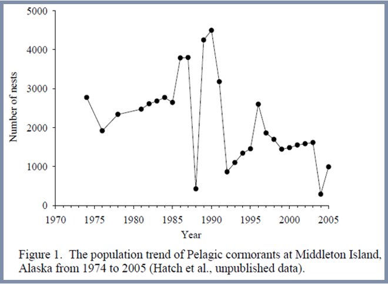
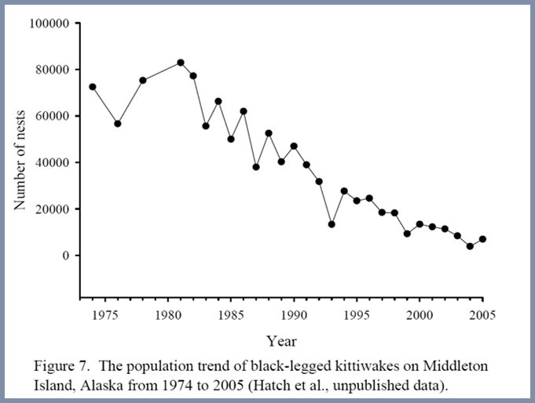

# Introduction {visibility="hidden"}


<!-- ## {content-align="center" style="font-size: 160%;" background-image="figs/tuna.jpg" background-opacity=0.2} -->
## {content-align="center" style="font-size: 160%;"}

<center>

Stochastic Population Models

<br>

{height="3.5in"}
{height="3.5in"}

</center>


## Today in APD

::: {style="font-size: 120%;"}

<br>

Random variables

<br>

Environmental stochasticity

<br>

Demographic stochasticity

:::


## Random variables
  
::: {style='font-size: 80%;'}

A random variable is a variable whose value can't be predicted
with certainty. 
  
<br>

::: {.fragment}
Examples

  *  Weather
  *  Our own behavior
  *  Population size
:::

:::

<br>
  
::: {.fragment style="color: SeaGreen;"}
<center>
**Is the universe random? Or is just too complex to be predicted with certainty?**
</center>
:::


## Probability distributions
  
A random variable ($X$) can be described by a probability distribution.

<br>
  
There are many types of probability distributions, including:
  
   * Normal (or Gaussian)
   * Poisson
   * Binomial
   * Multinomial


## Normal (Gaussian) Distribution

::: {style='font-size: 80%;'}
$$
  X \sim \mbox{Normal}(\mu=0, \sigma^2=1)
$$
:::

```{r}
#| label: norm
#| echo: false
#| results: 'hide'
#| eval: true
#| include: false
#| output-location: fragment
## if(!dir.exists("figs/norm"))
##     dir.create("figs/norm")
## pdf("figs/norm/norm0.pdf", width=8, height=6)
curve(dnorm(x, mean=0, sd=1), -3, 3,
      xlab="X", yaxt="n", ylab="", cex.lab=1.4)
## dev.off()
x <- numeric(10)
set.seed(4549)
for(i in 1:10) {
    ## fl <- paste("figs/norm/norm", i, ".pdf", sep="")
    ## pdf(fl, width=8, height=6)
    curve(dnorm(x, mean=0, sd=1), -3, 3,
      xlab="X", yaxt="n", ylab="", cex.lab=1.4)
    x[i] <- rnorm(1, mean=0, sd=1)
    points(x[1:i], rep(0, i), col="orange", cex=1.5, lwd=2, pch=16)
    ## dev.off()
}
```


<center>
::: {.r-stack}
::: {.fragment .fade-out fragment-index=1}
  
:::
::: {.fragment .fade-in-then-out fragment-index=1}
  
:::
::: {.fragment .fade-in-then-out fragment-index=2}
  
:::
::: {.fragment .fade-in-then-out fragment-index=3}
  
:::
::: {.fragment .fade-in-then-out fragment-index=4}
  
:::
::: {.fragment .fade-in-then-out fragment-index=5}
  
:::
::: {.fragment .fade-in-then-out fragment-index=6}
  
:::
::: {.fragment .fade-in-then-out fragment-index=7}
  
:::
::: {.fragment .fade-in-then-out fragment-index=8}
  
:::
::: {.fragment .fade-in-then-out fragment-index=9}
  
:::
:::
</center>


## Normal (Gaussian) distribution
  

```{r}
#| label: normals
#| echo: false
#| fig-width: 8
#| fig-height: 6
#| fig-align: center
curve(dnorm(x, 0, 0.6), -2, 2, xlab="X", cex.lab=1.4,
      ylab="Probability density", ylim=c(0, 3), lwd=3)
curve(dnorm(x, 0, 0.4), -2, 2, col="blue", lwd=3, add=TRUE)
curve(dnorm(x, 0, 0.2), -2, 2, col="red", lwd=3, add=TRUE)
legend(-2.1, 3, c(expression(paste(mu, "=0, ", sigma^2, "=0.6")),
                  expression(paste(mu, "=0, ", sigma^2, "=0.4")),
                  expression(paste(mu, "=0, ", sigma^2, "=0.2"))),
       col=c("black", "blue", "red"), lwd=2, cex=0.9)
```


## A purely stochastic model
  
::: {style='font-size: 80%;'}
$$
  N_t \sim \mbox{Normal}(\mu=50, \sigma^2=1)
$$
:::
  
```{r}
#| label: normpop
#| include: true
#| echo: false
#| fig.width: 8
#| fig.height: 6
#| fig-align: center
x <- rnorm(100, 50)
plot(x, type="o", xlab="Time", ylab="Population size (N)", cex.lab=1.4)
```

<!-- <center> -->
<!-- ![]{figure/normpop-1} -->
<!-- </center> -->


## Two important types of stochasticity

::: {style='font-size: 90%;'}
**Environmental stochasticity**
  
  * Random variation in demographic rates (such as birth and death rates)
  * Caused by unpredictable changes (e.g., in weather, habitat, ... conditions) among years

<br>

::: {.fragment}
**Demographic stochasticity**
  
  * Random variation in demographic outcomes (such as the number of births and deaths)
  * Occurs even when demographic rates are constant 
:::
:::


# Environmental stochasticity {visibility="hidden"}


##  Geometric growth with env. stochasticity
  
::: {style='font-size: 80%;'}
$$
  N_{t+1} = N_t + N_t r_t
$$

$$
  r_t \sim \mbox{Normal}(\bar{r}, \sigma^2)
$$ 
:::

R code
```{r}
#| label: geo-env
#| echo: true
#| eval: false
#| size: 'small'
nYears <- 20
N <- r <- rep(NA, nYears)  ## Create empty N and r
N[1] <- 100                ## Initial value of N
r.bar <- 0.5               ## Average growth rate
sigma <- 0.1               ## StdDev of growth rate
for(t in 2:nYears) {
    r[t-1] <- rnorm(n=1, mean=r.bar, sd=sigma)
    N[t] <- N[t-1] + N[t-1]*r[t-1]
}
```


##  Geometric growth with env. stochasticity

::: {style='font-size: 80%;'}
$$
  r_t \sim \mbox{Normal}(\bar{r}=0.1, \sigma^2=0.01)
$$ 
:::


```{r}
#| label: geo-env-ex
#| fig.show: 'hide'
#| echo: false
r.bar <- 0.1
sigma.e <- 0.1
T <- 20
## if(!dir.exists("figs/exp-d"))
##     dir.create("figs/exp-d")
for(i in 1:10) {
    N <- integer(T+1)
    N[1] <- 100
    ## fl <- paste("figs/exp-d/exp-d", i, ".pdf", sep="")
    for(t in 1:T) {
        r.t <- rnorm(1, r.bar, sigma.e)
        N[t+1] <- N[t] + N[t]*r.t
    }
    ## pdf(fl, width=8, height=6)
    par(mai=c(0.9,0.9,0.1,0.1))
    plot(0:T, N, type="b", xlab="Time", ylab="Population size (N)",
         ylim=c(0, 1000), cex.lab=1.4)
    plot(function(x) N[1]*(1+r.bar)^x, 0, T+1, add=TRUE)
    abline(h=0, col=gray(0.8))
    ## dev.off()
}
```


<center>
::: {.r-stack}
::: {.fragment .fade-out fragment-index=1}
  
:::
::: {.fragment .fade-in-then-out fragment-index=1}
  
:::
::: {.fragment .fade-in-then-out fragment-index=2}
  
:::
::: {.fragment .fade-in-then-out fragment-index=3}
  
:::
::: {.fragment .fade-in-then-out fragment-index=4}
  
:::
::: {.fragment .fade-in-then-out fragment-index=5}
  
:::
::: {.fragment .fade-in-then-out fragment-index=6}
  
:::
::: {.fragment .fade-in-then-out fragment-index=7}
  
:::
::: {.fragment .fade-in-then-out fragment-index=8}
  
:::
::: {.fragment .fade-in-then-out fragment-index=9}
  
:::
:::
</center>


##  Geometric growth with env. stochasticity

::: {style='font-size: 80%;'}
$$
  r_t \sim \mbox{Normal}(\bar{r}=0.1, \sigma^2=0.25)
$$ 
:::


```{r}
#| label: geo-env-ex2
#| fig.show: 'hide'
#| echo: false
r.bar <- 0.1
sigma.e <- 0.25
T <- 20
## if(!dir.exists("figs/exp-d"))
##     dir.create("figs/exp-d")
for(i in 1:10) {
    N <- integer(T+1)
    N[1] <- 100
    ## fl <- paste("figs/exp-d/exp-d", i, ".pdf", sep="")
    for(t in 1:T) {
        r.t <- rnorm(1, r.bar, sigma.e)
        N[t+1] <- N[t] + N[t]*r.t
    }
    ## pdf(fl, width=8, height=6)
    par(mai=c(0.9,0.9,0.1,0.1))
    plot(0:T, N, type="b", xlab="Time", ylab="Population size (N)",
         ylim=c(0, 1000), cex.lab=1.4)
    plot(function(x) N[1]*(1+r.bar)^x, 0, T+1, add=TRUE)
    abline(h=0, col=gray(0.8))
    ## dev.off()
}
```


<center>
::: {.r-stack}
::: {.fragment .fade-out fragment-index=1}
  
:::
::: {.fragment .fade-in-then-out fragment-index=1}
  
:::
::: {.fragment .fade-in-then-out fragment-index=2}
  
:::
::: {.fragment .fade-in-then-out fragment-index=3}
  
:::
::: {.fragment .fade-in-then-out fragment-index=4}
  
:::
::: {.fragment .fade-in-then-out fragment-index=5}
  
:::
::: {.fragment .fade-in-then-out fragment-index=6}
  
:::
::: {.fragment .fade-in-then-out fragment-index=7}
  
:::
::: {.fragment .fade-in-then-out fragment-index=8}
  
:::
::: {.fragment .fade-in-then-out fragment-index=9}
  
:::
:::
</center>


##  Logistic growth with environmental stochasticity

<br>

Imagine the carrying capacity fluctuates randomly.

<br>

$$
  N_{t+1} = N_t + N_tr_{max}(1 - N_t/K_t)
$$


::: {.fragment}
$$
  K_t \sim \mbox{Normal}(\bar{K}, \sigma^2)
$$
:::


## Logistic example with environmental stochasticity

::: {style='font-size: 80%;'}
$$
  K_t \sim \mbox{Normal}(\bar{K}=200, \sigma^2=50)
$$
:::

```{r}
#| label: logistic-ex
#| fig.show: 'hide'
#| echo: false
r.max <- 0.3
K.bar <- 200
sigma.d <- 50
T <- 20
## if(!dir.exists("figs/lg-d"))
##     dir.create("figs/lg-d")
set.seed(4450)
for(i in 1:10) {
    N <- Nlr <- integer(T+1)
    N[1] <- Nlr[1] <- 50 ##200
    fl <- paste("figs/lg-d/lg-d", i, ".pdf", sep="")
    for(t in 1:T) {
        K.t <- rnorm(1, K.bar, sigma.d)
        N[t+1] <- N[t] + N[t]*r.max*(1 - N[t]/K.t)
        Nlr[t+1] <- Nlr[t] + Nlr[t]*r.max*(1 - Nlr[t]/K.bar)
    }
    ## pdf(fl, width=8, height=6)
    par(mai=c(0.9,0.9,0.1,0.1))
    plot(0:T, N, type="b", xlab="Time", ylab="Population size (N)",
         ylim=c(0, 300), cex.lab=1.4)
    lines(0:T, Nlr)
    abline(h=0, col=gray(0.8))
    ## dev.off()
}
```

<center>
::: {.r-stack}
::: {.fragment .fade-out fragment-index=1}
  
:::
::: {.fragment .fade-in-then-out fragment-index=1}
  
:::
::: {.fragment .fade-in-then-out fragment-index=2}
  
:::
::: {.fragment .fade-in-then-out fragment-index=3}
  
:::
::: {.fragment .fade-in-then-out fragment-index=4}
  
:::
::: {.fragment .fade-in-then-out fragment-index=5}
  
:::
::: {.fragment .fade-in-then-out fragment-index=6}
  
:::
::: {.fragment .fade-in-then-out fragment-index=7}
  
:::
::: {.fragment .fade-in-then-out fragment-index=8}
  
:::
::: {.fragment .fade-in-then-out fragment-index=9}
  
:::
:::
</center>


# Demographic stochasticity {visibility="hidden"}


## Demographic stochasticity

::: {style='font-size: 80%;'}
We can make the BIDE model stochastic by modeling random variation
in the number of individuals that are born and die each year (we'll
ignore movement):

$$
   N_{t+1} = N_t + B_t - D_t
$$
  
<br>

::: {.fragment}
What distributions should we use for $B_t$ and $D_t$? 
:::


::: {.fragment}
$$
  B_t \sim \mathrm{Poisson}(N_t\times b)
$$
$$
  D_t \sim \mathrm{Binomial}(N_t, d)
$$
:::

:::


## Poisson distribution

::: {style='font-size: 90%;'}
The Poisson distribution is useful for data that are non-negative integers. 

<br>

It has a single parameter that describes the expected value of the random outcomes.

<br>
  
::: {.fragment}
In stochastic population models, the Poisson distribution can be used to model the number of births ($B_t$) that occur in a time interval.
  
$$
  B_t \sim \mathrm{Poisson}(N_t \times b)
$$
:::

:::


## Poisson distributions

```{r}
#| label: pois
#| echo: false
#| fig.width: 7
#| fig.height: 5
#| out.width: "0.9<br>textwidth"
#| fig.align: 'center'
par(mfrow=c(2,2), mai=c(0.8,0.8,0.2,0.2))
X <- 0:50
plot(X, dpois(X, 1), type="h", lwd=2, xlab="Births", ylab="Probability",
     main="Poisson(1)", col="royalblue")
plot(X, dpois(X, 10), type="h", lwd=2, xlab="Births", ylab="Probability",
     main="Poisson(10)", col="royalblue")
plot(X, dpois(X, 20), type="h", lwd=2, xlab="Births", ylab="Probability",
     main="Poisson(20)", col="royalblue")
plot(X, dpois(X, 30), type="h", lwd=2, xlab="Births", ylab="Probability",
     main="Poisson(30)", col="royalblue")
```


## Binomial distribution

The binomial distribution is also useful for data that are non-negative integers, but it has an upper bound. 

<br>
  
::: {.fragment}
In population models, the upper bound is often population size, and we use the model to describe how many individuals die during some time period. 

<br>

$$
  D_t \sim \mathrm{Binomial}(N_t, d)
$$
:::


## Binomial distributions

```{r}
#| label: bin
#| echo: false
#| fig.width: 7
#| fig.height: 5
#| out.width: "0.9<br>textwidth"
#| fig.align: 'center'
par(mfrow=c(2,2), mai=c(0.8,0.8,0.2,0.2))
N <- 10
X <- 0:N
plot(X, dbinom(X, N, 0.1), type="h", lwd=3, xlab="Deaths", ylab="Probability",
     main="Binomial(10, 0.1)", col="royalblue")
plot(X, dbinom(X, N, 0.3), type="h", lwd=3, xlab="Deaths", ylab="Probability",
     main="Binomial(10, 0.3)", col="royalblue")
plot(X, dbinom(X, N, 0.6), type="h", lwd=3, xlab="Deaths", ylab="Probability",
     main="Binomial(10, 0.6)", col="royalblue")
plot(X, dbinom(X, N, 0.9), type="h", lwd=3, xlab="Deaths", ylab="Probability",
     main="Binomial(10, 0.9)", col="royalblue")
```


## Demographic stochasticity

::: {style='font-size: 70%;'}
Poisson-Binomial birth-death model. 

$$
\begin{gather*}
  N_{t+1} = N_t + B_t - D_t \\
  B_t \sim \mathrm{Poisson}(N_t \times b) \\
  D_t \sim \mathrm{Binomial}(N_t, d)
\end{gather*}
$$
:::

```{r}
#| label: pois-bin
#| fig.width: 7
#| fig.height: 5
#| out.width: "0.7<br>textwidth"
#| fig.align: 'center'
#| echo: false
par(mai=c(0.9,0.9,0.2,0.2))  
b <- 0.15  ## Birth rate
d <- 0.2   ## Mortality rate
nYears <- 50
N2 <- rep(NA, nYears)  ## Empty vector for population size 
B <- rep(NA, nYears-1)   ## Random variable for nBirths
D <- rep(NA, nYears-1)   ## Random variable for nDeaths
N2[1] <- 100           ## Initial population size
for(t in 2:nYears) {
    B[t-1] <- rpois(n=1, lambda=N2[t-1]*b)
    D[t-1] <- rbinom(n=1, size=N2[t-1], prob=d)
    N2[t] <- N2[t-1] + B[t-1] - D[t-1]
}
plot(1:nYears, N2, xlab="Time", ylab="Abundance", type="l")
## lines(1:(nYears-1), B)
```


## Summary
  
<br>

Purely deterministic models are too rigid. 

<br>
  
Purely stochastic models don't describe population processes. 

<br>

The goal is to develop mechanistic models that represent 
our biological understanding while allowing for uncertainty.


